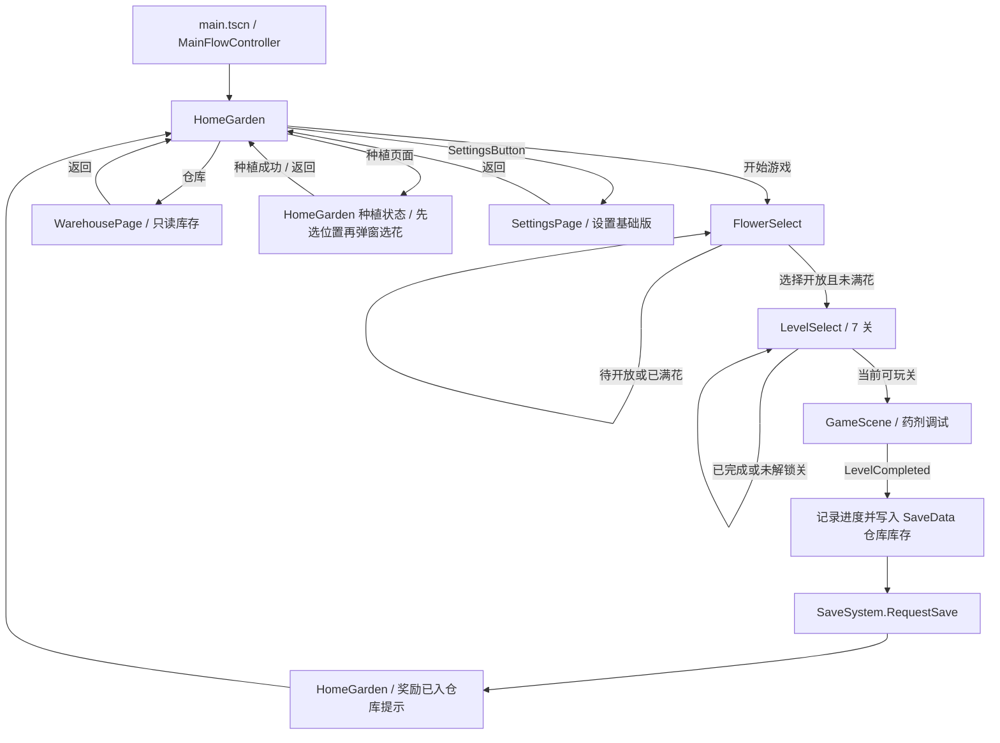
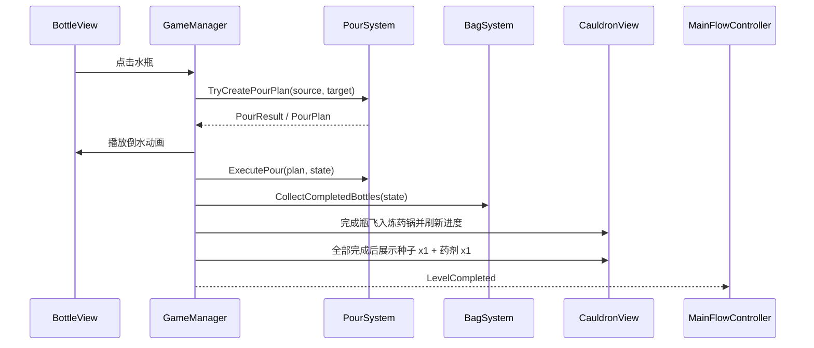

# 04 架构文档

## 权威文档导航

本项目当前以四份权威文档为准，`docs/archive/` 只作为历史参考，不作为当前执行依据。

| 文档 | 职责 |
| --- | --- |
| `docs/01_需求文档.md` | 产品需求、玩法规则、阶段目标、验收口径 |
| `docs/02_执行文档.md` | Codex / 开发者执行规则、验证要求、文档同步规则 |
| `docs/03_实现文档.md` | 当前实现状态、已知问题、未确认项、最近验证结果 |
| `docs/04_架构文档.md` | 模块边界、状态归属、场景关系、数据流、禁止越界职责 |

## 状态标签

| 标签 | 含义 |
| --- | --- |
| `[CURRENT]` | 当前正式生效 |
| `[PLANNED]` | 已确认规划，但尚未实现 |
| `[DEPRECATED]` | 历史遗留，不作为正式流程 |
| `[UNVERIFIED]` | 已实现或已接入，但真实窗口 / 完整链路未确认 |
| `[DEBT]` | 架构债务、命名债务或临时兼容层 |

AI agent 阅读要求：本文档只判断“模块归谁管”和“哪些职责禁止越界”。产品需求以 `docs/01_需求文档.md` 为准；执行和验证要求以 `docs/02_执行文档.md` 为准；当前实现状态和验证结果以 `docs/03_实现文档.md` 为准。

## 架构版本信息

| 项目 | 内容 |
| --- | --- |
| 文档名称 | `docs/04_架构文档.md` |
| 当前阶段 | `[CURRENT]` 第三阶段第十批已部分落地；`[PLANNED]` 第三阶段上线前最后阶段蓝图待继续分批实现 |
| 当前主入口 | `[CURRENT]` `main.tscn` |
| 当前正式流程 | `[CURRENT]` 第三阶段第十批已部分落地：既有正式流程、只读仓库、HomeGarden 内种植 / 铲花和 SettingsPage 不变；`MainFlowController -> GameManager -> LevelGenerator` 传递 `flower_id + level_number` 并生成可验证可解关卡；`LocalizationManager` / `TutorialSystem` 基础版继续生效，两者真实窗口视觉已由用户确认；`AudioManager` 继续保持基础音频路由、音量同步、单首 BGM 重复播放和缺素材 no-op |
| 当前状态归属 | `[CURRENT]` 当前外层运行期选择、关卡选择和 HomeGarden 花位镜像仍归 `RunSessionState`；倒水关卡内部状态归 `GameState`；关卡难度参数归 `LevelDifficultyConfig`，生成统计 / 已知解只存在于 `LevelGenerator` 当前生成周期，不写入 `SaveData` / `RunSessionState`；教程显示记录归 `SaveData.tutorial_bubbles_shown`；`LocalizationManager` 只持有当前运行期语言；`AudioManager` 只消费设置音量并管理播放入口 |
| 当前架构债务 | `[DEBT]` `Bag*` 历史命名仍作为炼药锅调试进度兼容层、`[DEPRECATED]` `RewardFlower*` 旧四选一流程遗留、`[DEBT]` `PendingPlanting` / `HasSeed` / `HasPotion` 字段和第二阶段临时种植 FX 保留为兼容层但当前通关出口不再设置、`[DEPRECATED]` 旧简单随机关卡入口仅作调试兼容；可解生成器真实窗口难度体验、炼药锅动画与 HomeGarden 整体真实窗口验收未确认；HomeGarden 主页素材规则已改为场景可视化节点权威 |
| 最后整理日期 | 2026-06-11 |
| 本文档职责 | 记录模块边界、状态归属、场景关系、数据流和禁止越界职责；不记录需求验收或当前实现验证结论。 |

## 状态归属表

| 模块 / 类型 | 状态归属 | 允许职责 | 不允许职责 |
| --- | --- | --- | --- |
| `RunSessionState` | `[CURRENT]` 第二阶段运行期外层状态与第三阶段仓库种植待提交兼容状态 | 保存 `SelectedFlowerId`、`SelectedLevelNumber`、每花 7 关进度、`IsWarehousePlantingMode`、`PendingPlantingFlowerId`、`HasSeed`、`HasPotion`、`PendingPlanting`、`slot -> flower_id 集合 / batch`；`IsWarehousePlantingMode` 表示当前正在 `HomeGarden` 等待玩家先选择 slot；`PendingPlanting` 仅作为旧待种植兼容字段保留 | 保存节点路径、图片路径、Godot 节点引用、本地存档路径或倒水关卡内部规则 |
| `GameState` | `[CURRENT]` 倒水关卡内部状态 | 保存水瓶、当前关卡目标颜色数 `RequiredColorCount`、炼药锅调试进度计数、按本局收集先后记录的 `CollectedColorOrder`、通关状态和关卡内数据；当前计数字段仍使用 `[DEBT]` 历史 `Bags` / `BagData` 命名 | 保存主页种植、目标花选择、外层奖励 |
| `LevelDifficultyConfig` | `[CURRENT]` 关卡难度配置 | 按 1-7 关提供瓶数、颜色数、初始空瓶数、反向打乱步数和最大生成尝试次数 | 保存关卡进度、生成 UI、修改倒水规则 |
| `LevelGenerator` | `[CURRENT]` 关卡数据生成 | 根据 `flower_id + level_number` 稳定 seed 读取难度配置；从完成态反向打乱；生成候选后调用 `LevelQualityEvaluator` 做初始布局质量筛选；记录已知解；调用验证器；失败重试并使用安全兜底 | 写 `SaveData`、修改 `RunSessionState` 进度、生成 View、放宽 `PourSystem` 规则 |
| `LevelQualityEvaluator` | `[CURRENT]` 关卡初始布局质量检查 | 检查生成候选的真实瓶内颜色连续段、视觉揭示顺序第 3 / 4 层不同硬规则和初始顶层真实颜色暴露数量；视觉揭示顺序第 3 / 4 层对应数据 `Layer_1` / `Layer_0`，硬规则为 `layers[0].Color != layers[1].Color`；只判断初始布局质量 | 判断单次倒水是否合法、修改 `GameState`、调用 `BottleView`、改写 `PourSystem` / `BottleData` / `WaterLayer` / `PourPlan` / `PourResult` |
| `LevelSolvabilityVerifier` | `[CURRENT]` 纯数据可解性验证 | 克隆关卡数据；复制 `PourSystem` 当前单次合法性、顶层揭示和同色连续层语义；先回放已知解，需要时在 50,000 状态 / 96 深度上限内搜索 | 修改真实 `GameState`、调用 `BottleView`、改写 `PourSystem` / `BottleData` / `WaterLayer` / `PourPlan` / `PourResult` |
| `BottleLayoutHelper` | `[CURRENT]` `GameScene` 水瓶坐标配置 | 按瓶数返回 6 瓶 3+3、7 瓶 4+3、8 瓶 4+4 的唯一竖屏坐标；未知瓶数 warning 后返回安全自动网格；6 / 7 / 8 瓶真实窗口布局已由用户确认通过 | 创建 / 删除节点、绑定 `BottleData`、判断倒水规则、生成关卡或修改外层进度 |
| `SettingsData` | `[CURRENT]` 长期设置数据 | 保存 `music_volume`、`sfx_volume`、`language` 和默认值；`Normalize()` 负责音量 0.0-1.0 与 `zh` / `en` 兜底 | 保存水瓶状态、关卡内临时选择、主页花位或 UI 节点引用 |
| `AudioManager` | `[CURRENT]` 集中音频播放与音量应用 | 初始化和持有 BGM / SFX `AudioStreamPlayer`；读取 `SettingsData` snapshot 应用音乐 / 音效音量；提供 `PlayClick()`、`PlayPour()`、`PlayBlocked()`、`PlaySuccess()` 和 BGM 入口；当前加载单首正式 BGM `bgm_pure_morning.mp3`，并在曲目结束后重复播放同一首；缺音频素材时 warning + 安全 no-op | 写入 `SaveData`、读写 `user://save_data.json`、修改 `RunSessionState`、判断倒水规则、处理 UI 文案、本地化、教程、广告或内购 |
| `LocalizationManager` / `LocalizedTextTable` | `[CURRENT]` 当前语言与集中 UI 文案 | 保存当前 `zh` / `en` 语言；根据 key 返回文本；非法语言回退 `zh`；缺 key / 缺语言 warning + 安全兜底；向 View 提供文本 | 写入 `SaveData`、读写 `user://save_data.json`、修改 `RunSessionState`、操作 `AudioManager`、判断倒水规则、维护页面业务状态 |
| `TutorialSystem` | `[CURRENT]` 教程首次显示判断与存档字典访问 | 持有当前 `SaveData` / `LocalizationManager` / `TutorialBubbleView` 引用；判断 tutorial key 是否已显示；首次显示时写入 `tutorial_bubbles_shown`；获取当前语言文案并请求气泡显示 | 判断倒水规则、切换页面、锁按钮、直接读写 `user://save_data.json`、处理音频、维护各页面业务状态 |
| `TutorialBubbleView` | `[CURRENT]` 非阻塞教程气泡表现层 | 显示当前教程文本；支持点击 / 关闭按钮关闭和 5 秒自动隐藏；根覆盖层忽略页面输入 | 写 `SaveData`、读存档、判断首次显示、处理页面跳转、强制玩家完成流程、使用模态确认 |
| `HomeGarden.tscn` | `[CURRENT]` HomeGarden 主页素材显示场景权威 | 保存主页素材节点的 texture、anchors、offset、scale、`z_index`、遮挡层级和可视布局 | 保存运行期种植状态、决定奖励或关卡流程 |
| `FlowerSelect.tscn` | `[CURRENT]` FlowerSelect 选择花页素材显示场景权威 | 保存外层背景、中间面板、6 个 `FlowerSlot_XX`、每 slot 的 `OpenCardTexture` / `DisabledCardTexture`、花名 / 状态文字、点击热区，以及可见 `BackButton` 的底图、文字、字号、颜色、位置和点击区域 | 保存目标花选择状态、决定外层流程、运行时切换卡片 texture、用代码改写卡片或返回按钮布局 |
| `HomeGardenView` | 主页显示和点击输入 | 读取 `RunSessionState` 的 slot batch；决定显示哪个已有节点；隐藏同 slot 下不该显示的节点；根据 `PlantingSystem` 提供的 slot 可操作 snapshot 控制数字圆圈按钮显示；处理数字圆圈圆形点击；显示该 slot 操作面板；上报“slot X 选择 flower_id Y 种植”“slot X 铲全部”“slot X 铲 flower_id Y”的用户意图；上报打开仓库和设置页意图 | 保存唯一真实状态、绕过 `RunSessionState` 直接决定奖励、动态加载主页 `home_slots` 贴图、动态创建主页花图节点、动态设置主页花图 Texture 或布局参数、直接改库存、直接写 `SaveData` |
| `MainFlowController` | 外层流程切换和通关后长期状态提交 | 切换 `HomeGarden`、`LevelSelect`、`FlowerSelect`、`GameScene`、`WarehousePage`、`SettingsPage`；进入 `GameScene` 时只传递 `SelectedFlowerId` / `SelectedLevelNumber`；通关后记录关卡进度和仓库奖励并请求保存；管理 HomeGarden 种植 / 铲花提交；接收设置变更和重置；同步 `AudioManager`、`LocalizationManager` 和 `TutorialSystem` | 生成关卡数据、判断倒水合法性、保存瓶内水层数据、直接操作 `GameScene` 内部水瓶状态、让 View 直接保存长期数据 |
| `PlantingSystem` | 种植与铲花业务规则 | 从 `SaveData` / `RunSessionState` 构造每个 slot 是否可打开操作面板的 snapshot；按库存和当前 slot 已有花构造可种花列表；按当前 slot 已有花构造可铲花列表；校验库存、slot 重复、花位规则和铲花请求；`HomeGarden` 弹窗选择提交成功时扣减库存或返还库存、更新 flower_id batch、写入 `SaveData.home_slots_by_slot` 并同步运行期镜像 | 判断倒水规则、处理通关奖励、操作 `HomeGarden.tscn` 可视节点、让 `PlantingPageView` 作为正式流程选择花或主页 slot、实现设置 / 音频 / 教程等未确认功能 |
| `PlantingPageView` | 历史 / 备用种植入口表现层 | 文件可保留，显示开放花库存 snapshot 和可种植状态的旧实现可作为历史参考或备用 | 作为当前正式流程入口、显示或提交主页 slot 01-07、创建 `SaveSystem`、直接写 `SaveData`、直接扣减库存、直接修改 `RunSessionState`、操作 `HomeGardenView` 或倒水状态 |
| `BagSystem` | `[CURRENT]` 炼药锅调试进度收集规则；名称为历史兼容 | 只收集满 4 层、真实颜色相同且所有层 `IsRevealed` 的瓶子；更新 `Bags`、`CollectedColorOrder` 和瓶子收集状态 | 判断倒水合法性、揭示水层、处理 View 动画、生成关卡或修改外层状态 |
| `GameManager` | 倒水关卡内部流程 | 接收 `flower_id + level_number` 并调用 `LevelGenerator`；按生成瓶数绑定、动态补齐、复用和停用 `BottleView`；消费 `BottleLayoutHelper` 坐标并保证可见瓶唯一位置；处理水瓶点击、调用 `PourSystem`、触发 `BagSystem` 收集、按 `GameState.RequiredColorCount` 判断胜利并驱动 `CauldronView` 表现、奖励层展示完成后发出 `LevelCompleted`；收到关卡内退出意图后发出 `ExitRequested` | 自行选择奖励花、写主页花位、处理外层种植、把退出当作通关、修改 `PourSystem` 规则、把布局职责交给 `LevelSelectView` |
| `CauldronView` | GameScene 炼药锅表现层 | 按 `GameManager` 传入的目标颜色数显示 4 / 5 / 6 个进度格；按 `CollectedColorOrder` 从左到右点亮已收集颜色；播放完成瓶飞向炼药锅、显示目标花种子 / 药剂图片奖励层、3 秒自动继续、`GoPlantButton` 跳过等待 | 判断倒水规则、判断满瓶同色、生成外层奖励或主页种植状态、直接写 `RunSessionState` 或操作 `HomeGarden` |
| `BottleView` | 水瓶表现层 | 显示水瓶、点击输入、倒水动画和反馈；接收 `GameManager` 分配的布局坐标并同步动画基准位置；停用时隐藏并禁用碰撞；点击、选中上移、倒水动画基准和 8→6 无可见残留已由用户真实窗口确认 | 判断倒水规则、保存唯一真实水层状态、按关卡号自行决定布局 |
| `FlowerSelectView` | 目标花选择表现层 | 读取 `FlowerSelect.tscn` 预置节点，按 `FlowerOption` 只刷新 slot 可见性、花名、状态文字、提示和点击信号；灰态待开放 / 已满花只提示；开放花只发出 `TargetFlowerSelected(flower_id)` | 动态创建选花按钮、运行时切换卡片 texture、运行时设置卡片或返回按钮 position / size / anchors / offset / scale / `z_index`、直接进入 `GameScene` 或写入主页花位 |
| `LevelSelectView` | 关卡选择表现层 | 显示所选花的 7 个外层关卡和可玩状态 | 生成倒水关卡数据或绕过 `RunSessionState` 修改进度 |
| `WarehousePageView` | 仓库只读表现层 | 显示库存 snapshot 中每个开放花的 `seed_count` 和 `potion_count`；发出返回 HomeGarden 意图；道具缺图时 warning 并隐藏图标 | 创建 `SaveSystem`、修改 `SaveData`、扣减 / 返还库存、处理通关信号、处理种植逻辑、修改倒水状态 |
| `SettingsPageView` | 设置页表现层 | 显示 `SettingsData` snapshot；上报音乐音量、音效音量、语言、只重置进度确认、重置全部设置确认和返回 HomeGarden 意图；显示确认弹窗和结果提示 | 创建 `SaveSystem`、直接读写 `user://save_data.json`、直接修改 `SaveData` / `RunSessionState`、操作 `HomeGardenView`、直接操作 `AudioManager`、执行全 UI 本地化替换 |

## 信号 / 流程契约

1. `HomeGarden` 点击“开始游戏”后，由 `HomeGardenView` 发出开始意图；当前第三阶段第二批不再因为 `RunSessionState.PendingPlanting` 阻止进入 `FlowerSelect`。
2. `MainFlowController` 切换到 `FlowerSelect`。
3. `FlowerSelect` 只对开放且未满花发出 `flower_id` 选择信号；待开放花和已满花只显示提示。
4. `MainFlowController` 将开放花写入 `RunSessionState.SelectedFlowerId`，然后切换到 `LevelSelect`。
5. `LevelSelect` 根据 `RunSessionState` 显示所选花的 7 个关卡，只有当前可玩关会发出关卡选择信号。
6. `MainFlowController` 将当前可玩关写入 `RunSessionState.SelectedLevelNumber` 后加载 `GameScene`。
- `MainFlowController` 只把 `SelectedFlowerId` / `SelectedLevelNumber` 传给 `GameManager`；`GameManager` 调用 `LevelGenerator.GenerateSolvableLevel()`，生成器内部读取 `LevelDifficultyConfig`，先用 `LevelQualityEvaluator` 筛掉初始布局质量不合格候选，再调用 `LevelSolvabilityVerifier`。
- `GameManager` 根据生成后的 `GameState.Bottles.Count` 创建或复用 `BottleView`，再从 `BottleLayoutHelper` 取得坐标；`GameScene.tscn` 只预置 6 个基础瓶，第 7 / 8 个由同一路径动态补齐。
- 重开或瓶数变化时，`GameManager` 必须重新同步节点；多余 `BottleView` 隐藏并禁用碰撞，不保留可见旧节点。`BottleView.ApplyLayoutPosition()` 必须同时更新显示位置和选中 / 摇晃动画的基准位置。
- `LevelSelectView` 不接触 `GameState`、`BottleData` 或生成 seed；`PourSystem` 不为生成器放宽或修改单次倒水规则；`BottleView` 和 `CauldronView` 不判断关卡生成质量。
7. `GameScene` 中 `UIManager.ExitRequested -> GameManager.ExitRequested -> MainFlowController.OnGameExitRequested` 表示退出药剂调试关卡。该信号只返回当前目标花的 `LevelSelect`，不触发 `LevelCompleted`，不生成 `PendingPlanting`，不发放种子或药剂，不改变关卡完成状态，不清空 `SelectedFlowerId`。
8. `GameScene` 全部颜色投入炼药锅后先展示目标花种子图片 + 药剂图片 + “种植”按钮奖励层；奖励层 3 秒后自动继续，或点击 `GoPlantButton` 立即跳过等待。展示结束后由 `GameManager.LevelCompleted` 通知外层，不直接处理主页花园状态。
9. `MainFlowController` 接到通关信号后，记录所选花当前关完成、解锁下一关，同步更新 `SaveData.level_progress_by_flower`。
10. `MainFlowController` 根据 `RunSessionState.SelectedFlowerId` 安全创建或读取 `SaveData.warehouse_inventory_by_flower[flower_id]`，执行 `seed_count += 1`、`potion_count += 1`，然后调用 `SaveSystem.RequestSave()`。
11. `MainFlowController` 不再设置 `PendingPlantingFlowerId`、`HasSeed`、`HasPotion` 或 `PendingPlanting`，并回到 `HomeGarden` 显示奖励已入仓库的轻提示。
12. 第二阶段 `PendingPlanting` 字段和 `HomeGardenView` 数字圆圈逻辑暂时保留为兼容旧种植代码，但不再作为当前通关奖励出口。
13. `HomeGarden` 点击临时“仓库”按钮后，由 `HomeGardenView.WarehouseRequested` 上报打开仓库意图；`MainFlowController.ShowWarehouse()` 加载 `WarehousePage`，从当前 `SaveData.warehouse_inventory_by_flower` 构造 `WarehouseInventoryRow[]` snapshot 传给 `WarehousePageView`。
14. `WarehousePageView.BackRequested` 只返回 `HomeGarden`；仓库页不创建 `SaveSystem`，不修改库存，不处理通关信号，不进入 `PlantingPage`。
15. `HomeGarden` 点击临时“种植页面”按钮后，由 `HomeGardenView.PlantingRequested` 上报进入种植状态意图；`MainFlowController.BeginWarehousePlantingMode()` 或等价流程设置 `RunSessionState.IsWarehousePlantingMode = true`，仍显示 `HomeGarden`，不加载 `PlantingPage`。
16. `MainFlowController` 在刷新 `HomeGarden` 时调用 `PlantingSystem.CreateHomeGardenSlotOptions()`，按仓库库存和当前 slot 已有花构造 1-7 数字圆圈可显示状态。
17. `HomeGardenView` 只显示可操作数字圆圈，并只接受圆形区域点击；点击背景、花图、slot 父节点和圆圈矩形外角不得弹窗或种植。
18. 数字圆圈中心点击后，`MainFlowController` 调用 `PlantingSystem.CreateAvailableFlowersForSlot()` 构造该 slot 可种花列表，并调用 `PlantingSystem.CreatePlantedFlowersForSlot()` 构造该 slot 可铲花列表，`HomeGardenView` 显示操作面板；可种列表只包含开放花、库存种子和药剂均 >= 1、当前 slot 尚未包含的 `flower_id`。
19. 弹窗选择可种 `flower_id` 后，`HomeGardenView` 只上报 “slot X 选择 flower_id Y 种植”；`MainFlowController` 调用 `PlantingSystem.ValidatePlant()` / `TryPlant()` 再次校验并提交。成功时扣减库存、写入 `SaveData.home_slots_by_slot`、同步 `RunSessionState.FlowerSlotBatches`、调用 `SaveSystem.RequestSave()`、清除种植模式并刷新 `HomeGarden`。
20. 弹窗选择铲全部后，`HomeGardenView` 只上报 “slot X 铲全部”；`MainFlowController` 调用 `PlantingSystem.TryShovelAll()`。成功时对该 slot 内每个 `flower_id` 返还 `seed_count + 1` 和 `potion_count + 1`，清空 slot，写入 `SaveData.home_slots_by_slot`，同步 `RunSessionState.FlowerSlotBatches`，调用 `SaveSystem.RequestSave()`、清除种植模式并刷新 `HomeGarden`。
21. 弹窗选择铲单种后，`HomeGardenView` 只上报 “slot X 铲 flower_id Y”；`MainFlowController` 调用 `PlantingSystem.TryShovelFlower()`。成功时只返还该 `flower_id` 的 `seed_count + 1` 和 `potion_count + 1`；若 slot 仍有其他花，则按 `RunSessionState.BuildComboKey()` 稳定排序写回 batch；若 slot 为空，则写为空 slot；随后同步运行期镜像、请求保存、清除种植模式并刷新 `HomeGarden`。
22. `CancelWarehousePlanting()` 只清除种植模式，不扣库存、不返还库存、不改 slot，并隐藏数字圆圈。
23. `HomeGarden` 右上角 `SettingsButton` 由 `HomeGardenView.SettingsRequested` 上报打开设置页意图；`MainFlowController.ShowSettings()` 加载 `SettingsPage`，从 `SaveData.Settings` 构造 `SettingsPageSnapshot` 传给 `SettingsPageView`。
24. `SettingsPageView` 修改音乐音量、音效音量或语言时只上报意图；`MainFlowController` 写入 `SaveData.Settings` 并调用 `SaveSystem.RequestSave()`；音乐 / 音效音量变化同时由 `MainFlowController` 同步到 `AudioManager`。
25. `SettingsPageView` 的两类重置按钮必须先弹出确认框；确认后只上报确认意图。只重置进度由 `MainFlowController` 调用 `SaveSystem.ResetProgressOnly()`，保留 `SettingsData`；重置全部由 `MainFlowController` 调用 `SaveSystem.ResetAllSettings()`，恢复默认设置。
26. 两类重置后，`MainFlowController` 从 `SaveSystem.CurrentData` 更新当前 `SaveData` 引用，并调用 `RunSessionState.ApplySaveData()` 同步关卡进度、主页花位和种植兼容状态；同时重新把当前 `SettingsData` 应用到 `AudioManager`，其中 `ResetProgressOnly()` 保留当前音量，`ResetAllSettings()` 恢复默认音量。
27. `AudioManager` 节点位于 `main.tscn` 根节点 `Main` 下，由 `MainFlowController` 查找并持有；若场景缺失可运行期兜底创建，但页面切换不得创建多个 BGM 播放器。
28. 按钮点击音效由外层流程或表现层在用户意图确认时调用 `AudioManager.PlayClick()`；合法 / 非法倒水音效由 `GameManager` 在 `PourSystem` 结果确认后调用；通关 / 奖励音效由关卡流程在奖励展示入口调用，不能重复播放。
29. `LocalizationManager` 节点位于 `main.tscn` 根节点 `Main` 下，由 `MainFlowController` 查找并持有；启动读取存档后应用 `SettingsData.language`，SettingsPage 切换时先保存设置再同步运行期语言。View 只接收 Manager / snapshot / provider，不直接读存档。
30. `TutorialSystem` 节点位于 `main.tscn/Main/TutorialSystem`；`TutorialBubbleView` 位于 `main.tscn/Main/TutorialLayer/TutorialBubbleView`，作为 `layer = 100` 的常驻覆盖层，不随页面切换销毁。
31. `MainFlowController` 在首次进入 HomeGarden、奖励入仓回 HomeGarden、进入 WarehousePage、进入 HomeGarden 种植状态、打开已有花位操作面板、进入 SettingsPage 时调用 `TutorialSystem.TryShowTutorial(key)`。
32. `TutorialSystem` 仅在 key 未显示时从 `LocalizationManager` 获取 `tutorial.{key}` 文案、调用 `TutorialBubbleView.ShowTutorial()` 并写入 `SaveData.tutorial_bubbles_shown[key] = true`；返回成功后由 `MainFlowController` 调用 `SaveSystem.RequestSave()`。
33. `ResetProgressOnly()` / `ResetAllSettings()` 生成新的 `SaveData` 后，`MainFlowController` 必须调用 `TutorialSystem.SynchronizeSaveData()`；气泡当前显示可关闭，但教程记录以新的存档字典为准。
34. `TutorialBubbleView` 根节点 `MouseFilter = Ignore`，只有气泡面板自身接收关闭输入；页面按钮、返回按钮和页面切换不得依赖教程完成状态。

## 禁止越界职责

- `GameScene` 不负责主页花园状态，只负责炼药锅调试表现、关卡内奖励层和通关信号。
- `GameScene` 的退出意图不属于通关信号；不得复用 `LevelCompleted` 或外层奖励生成入口。
- `GameManager` 不负责目标花选择。
- `BottleView` 不判断倒水规则。
- `HomeGardenView` 不保存唯一真实状态。
- `HomeGardenView` 不拥有主页贴图资源加载权威。
- `HomeGardenView` 不动态加载主页 `home_slots` 贴图。
- `HomeGardenView` 不动态创建主页花图节点。
- `HomeGardenView` 不动态设置主页花图 Texture。
- `HomeGardenView` 不动态设置主页花图 position、scale、offset、anchors 或 `z_index`。
- `RunSessionState` 不保存节点路径或图片路径。
- `PourSystem` 不处理选花、奖励、种植或主页流程。
- `PourSystem` 的合法性、倒水量和顶层揭示语义不为关卡生成器让步；验证器必须适配当前规则。
- `LevelSelectView` 不生成关卡、不构造 seed、不调用可解验证。
- `LevelSolvabilityVerifier` 不修改真实 `GameState`，不调用 `BottleView`，不写 `SaveData` / `RunSessionState`。
- `FlowerSelectView` 不直接写入 `RunSessionState` 的主页花位 batch。
- `FlowerSelectView` 不动态创建选花按钮，不运行时切换卡片 texture，不运行时修改卡片或返回按钮的 position、size、anchors、offset、scale 或 `z_index`。
- `RewardFlower*` 不作为当前正式流程入口；如继续存在，仅视为历史遗留或待后续重构对象。
- `WarehousePageView` 只读库存 snapshot，不直接保存、扣减或返还库存。
- `SettingsPageView` 只读设置 snapshot 并上报意图，不直接保存设置、不直接重置存档、不直接同步运行期状态。
- `SettingsPageView` 不直接操作 `AudioManager`；音量同步必须经 `MainFlowController`。
- `AudioManager` 不写 `SaveData`，不读写 `user://save_data.json`，不判断倒水规则，不处理本地化、教程、广告或内购。
- `LocalizationManager` 不写 `SaveData`，不读写 `user://save_data.json`，不修改 `RunSessionState`，不操作 `AudioManager`，不判断倒水规则。
- `TutorialSystem` 不判断倒水规则，不切换页面，不处理音频，不直接读写存档文件，不锁按钮或强制完成流程。
- `TutorialBubbleView` 不写 `SaveData`，不读 `user://save_data.json`，不判断教程是否首次显示，不处理流程跳转。
- 各 View 不维护独立中英文表；新增可切换 UI 文案必须进入 `LocalizedTextTable` 或等价集中表。
- 背景图片内文字不属于运行时 UI 文案，当前不受 `LocalizationManager` 控制；完整本地化需要独立多语言背景素材。
- `PlantingPageView` 不作为当前正式种植流程入口；不得显示主页 slot 列表，不直接保存、扣减库存或写主页花位。当前正式流程的种植位置选择和花选择只能经 `HomeGardenView` 数字圆圈与可种花弹窗上报到 `MainFlowController` / `PlantingSystem`。
- `PlantingSystem` 不操作 `HomeGarden.tscn` 可视节点，不判断倒水规则，不实现设置 / 音频 / 教程等未确认功能。

## [CURRENT] SaveSystem / TutorialSystem 基础版实际架构（2026-06-10）

本节记录第三阶段已落地的实际类名、状态归属和数据结构。当前页面流程仍由 `RunSessionState` 驱动；`SaveData` 已接管关卡进度、仓库库存、主页花位组合、SettingsPage 设置和教程显示记录持久化；`WarehousePage` 只读基础版已从 `SaveData` snapshot 显示库存；`PlantingPage` 文件保留为历史 / 备用页面；`AudioManager`、`LocalizationManager` 与 TutorialSystem 基础版均已接入。

实际类名：

- `scripts/model/SaveData.cs`
- `scripts/model/SettingsData.cs`
- `scripts/core/SaveSystem.cs`
- `scripts/core/AudioManager.cs`
- `scripts/core/LocalizationManager.cs`
- `scripts/model/LocalizedTextTable.cs`
- `scripts/core/TutorialSystem.cs`
- `scripts/view/TutorialBubbleView.cs`

实际存档路径与格式：

- 单一自动存档路径：`user://save_data.json`。
- 格式：缩进 JSON，便于开发期直接查看和调试。
- 不写 Windows 绝对路径，不引用 `素材/` staging 路径。

`SaveData` 当前字段：

- `schema_version`：存档结构版本，当前为 `1`。
- `level_progress_by_flower`：每个开放花的已完成关卡数量。
- `warehouse_inventory_by_flower`：`flower_id -> { seed_count, potion_count }`。
- `home_slots_by_slot`：`slot -> { slot, flower_ids, batch }`，其中 `batch` 使用 `RunSessionState.BuildComboKey()` 的开放花稳定排序。
- `tutorial_bubbles_shown`：教程气泡是否已显示过。
- `settings`：`SettingsData`。

`SettingsData` 当前字段：

- `music_volume`，默认 `0.8`。
- `sfx_volume`，默认 `0.8`。
- `language`，默认 `zh`。

`SaveSystem` 当前职责：

- 启动读取指定路径或默认 `user://save_data.json`。
- 无存档时创建默认 `SaveData`。
- 读取失败或 JSON 损坏时输出 warning，回退默认 `SaveData`，不崩溃。
- `RequestSave()` 使用短延迟 `Timer` 防抖保存。
- `ImmediateSave()` 立即写入当前数据。
- `ResetProgressOnly()` 重置进度、仓库、主页花位和教程字段，保留 `SettingsData`。
- `ResetAllSettings()` 重置全部数据并恢复设置默认值。

当前接入范围：

- `MainFlowController` 当前持有并初始化 `SaveSystem` 和当前 `SaveData`。
- `MainFlowController` 启动时将 `SaveData.level_progress_by_flower` 同步到 `RunSessionState`，用于刷新 `LevelSelect` 的当前可玩关；同时将 `SaveData.home_slots_by_slot` 同步到 `RunSessionState.FlowerSlotBatches`，用于刷新 `HomeGarden` 已种花位。
- `MainFlowController` 接到 `GameManager.LevelCompleted` 后写入 `SaveData.level_progress_by_flower` 和 `SaveData.warehouse_inventory_by_flower`，再调用 `SaveSystem.RequestSave()`。
- `MainFlowController` 接到 `SettingsPageView` 的音量或语言变化后写入 `SaveData.settings` 并调用 `SaveSystem.RequestSave()`；音乐 / 音效音量变化同步 `AudioManager`，语言变化同步 `LocalizationManager`；接到重置确认后调用 `ResetProgressOnly()` / `ResetAllSettings()`，同步 `RunSessionState`、`AudioManager`、`LocalizationManager` 和 `TutorialSystem`。
- `TutorialSystem` 首次显示 tutorial key 时写入 `SaveData.tutorial_bubbles_shown`；保存请求归 `MainFlowController`。`TutorialBubbleView` 只负责非阻塞显示和关闭。
- `PlantingSystem` 基础版成功种植时扣减 `SaveData.warehouse_inventory_by_flower`，写入 `SaveData.home_slots_by_slot`，并同步 `RunSessionState.FlowerSlotBatches`；铲全部 / 铲单种成功时返还对应 `flower_id` 的 `seed_count + 1` 和 `potion_count + 1`，写入 `SaveData.home_slots_by_slot`，并同步 `RunSessionState.FlowerSlotBatches`。
- `SaveData.FromRunSessionState()` 作为后续迁移桥，用于从现有 `RunSessionState` 生成存档镜像。
- `RunSessionState` 仍保留当前第二阶段运行期职责。
- 通关奖励已改为写入仓库库存；第二阶段 `PendingPlanting` 字段仍保留为兼容字段，但当前通关出口不再设置。
- `WarehousePage` 已以只读 snapshot 方式接入；当前正式种植流程已改为 HomeGarden 内先选位置再弹窗选花；`PlantingPage` 仅保留为历史 / 备用页面；`SettingsPage`、`AudioManager`、`LocalizationManager` 和 TutorialSystem 基础版已接入；第一批正式 SFX 和单首正式 BGM 已接入，真实听感仍待人工确认。

禁止越界边界：

- `SaveSystem` 不写入 `BottleView`、`PourSystem`、`UIManager`。
- `SaveSystem` 不判断倒水合法性，不修改 `BottleData`、`WaterLayer`、`PourPlan`、`PourResult`。
- `SaveSystem` 不操作 `HomeGarden.tscn` 主页花位可视化节点布局。
- `AudioManager` 不判断倒水合法性，不写存档，不读写 `user://save_data.json`。
- 本批不接 Google / Apple 账号绑定、云存档、广告或内购。

## [PLANNED] 第三阶段架构规划 / 上线前最后阶段

本节记录第三阶段目标架构，不表示当前代码、场景或资源已经实现。后续必须按独立任务逐步实现，并在实现后回填 `03_实现文档.md`。当前架构事实仍以本文件顶部 `[CURRENT]` 状态归属表和信号 / 流程契约为准。

### 第三阶段目标主流程

第三阶段目标主流程：

```text
HomeGarden -> 调试药剂 -> FlowerSelect -> LevelSelect -> GameScene -> 奖励入仓库 -> HomeGarden
HomeGarden -> 种植页面
HomeGarden -> 仓库
HomeGarden -> 设置页
```

说明：

- `HomeGarden` 右侧三块木牌目标文案为“调试药剂”“种植页面”“仓库”。
- `调试药剂` 替代当前“开始游戏”的语义，但仍进入 `FlowerSelect -> LevelSelect -> GameScene`。
- `GameScene` 通关后仍只发出 `LevelCompleted` 或等价信号，不直接操作仓库、存档或主页花位。
- 通关奖励由外层流程写入仓库库存，再回到 `HomeGarden`。
- `[CURRENT]` 第三阶段第二批已用 `SaveData` 仓库库存替代通关后的 `PendingPlanting` 奖励出口；第三阶段第四批二次纠偏后，正式种植入口为 HomeGarden 内先选位置再弹窗选花，`PlantingPage` 仅保留为历史 / 备用页面；第二阶段 `PendingPlanting` 旧字段和临时 FX 仍作为兼容代码保留。
- `[DEPRECATED]` 旧 `RewardFlower` 保留为历史遗留，不恢复为正式流程。

### 新增模块规划

第三阶段目标新增或扩展模块：

| 模块 | 目标职责 | 不允许职责 |
| --- | --- | --- |
| `SaveSystem` / `SaveData` | 单一自动存档；启动读取；保存关卡进度、仓库库存、主页花位组合、教程状态和设置镜像 | 写入倒水规则、直接操作 `BottleView` / `PourSystem` / `UIManager` |
| `SettingsData` | 保存音乐音量、音效音量、语言设置，以及设置默认值 | 保存水瓶状态或关卡内临时选择 |
| `WarehouseSystem` / `WarehouseInventory` | 按 `flower_id` 管理 `seed_count` 和 `potion_count`；处理奖励入库、种植扣减、铲花返还 | 判断倒水合法性、直接修改 `GameScene` 水瓶状态 |
| `WarehousePage` | 查看库存；分开显示种子和药剂数量 | 直接种植、直接修改倒水状态 |
| `PlantingSystem` / `PlantingPageView` | 使用库存种花；追加花；铲全部 / 铲单种；刷新花位组合；触发保存请求 | 判断倒水规则、生成关卡、直接处理通关奖励 |
| `LevelDifficultyConfig` / 可解 `LevelGenerator` | 按难度配置生成可验证可解的关卡数据 | 把生成逻辑写入 `LevelSelectView` |
| `AudioManager` / `AudioSettings` | 管理点击、倒水、通关、背景音乐和音量路由 | 把音效播放逻辑散落到每个按钮脚本里 |
| `LocalizationManager` / `TextTable` | 集中管理中文 / 英文 UI 文案和当前语言 | 在各 View 脚本中散落新增中英文硬编码 |
| `TutorialSystem` / `TutorialBubbleView` | `[CURRENT]` 管理非阻塞新手气泡和 `SaveData.tutorial_bubbles_shown`；独立 `GuideState` 当前未新增 | 锁按钮、阻塞页面跳转、强制完成完整流程 |

### 状态归属目标

第三阶段状态归属规划：

- 长期存档归 `SaveData`。
- 设置长期数据归 `SettingsData`。
- 运行期当前选择归 `RunSessionState` 或后续等价 `RuntimeState`。
- 仓库库存归 `WarehouseInventory` / `SaveData`。
- 主页花位组合归 `SaveData`，运行期可保留一份 `RuntimeState` 镜像用于刷新 UI。
- 音乐音量、音效音量和语言归 `SettingsData`。
- 教程气泡是否已显示归 `SaveData.tutorial_bubbles_shown`；`TutorialSystem` 只持有当前引用和访问入口，独立 `GuideState` 当前未新增。
- 倒水关卡内部水瓶状态仍归 `GameState`。

第三阶段存档必须覆盖：

- 每个开放花的关卡进度。
- 每个 `flower_id` 的 `seed_count` 和 `potion_count`。
- `slot -> flower_id 集合 / batch`。
- 种植 / 铲花结果。
- 音乐音量、音效音量、当前语言设置。
- 教程气泡是否已显示过。

### 库存与花位数据目标

仓库库存目标结构：

```text
flower_id -> {
  seed_count,
  potion_count
}
```

当前开放花至少包括：

- `pink_rose`
- `yellow_rose`
- `lavender`

后续 `flower_04` 到 `flower_06` 开放后按相同结构扩展。

花位数据继续沿用当前 `slot -> flower_id 集合 / batch` 方向：

- 同一花位可包含多种不同 `flower_id`。
- 同一 `flower_id` 在同一花位最多出现一次。
- 组合 key 按开放花顺序稳定排序。
- 种植成功后库存扣减并请求保存。
- 铲花后返还对应库存并请求保存。

### 禁止越界边界

第三阶段新增禁止越界规则：

- `PourSystem` 不处理仓库、存档、种植、账号、广告、音频设置或本地化设置。
- `BottleView` 不保存存档，不读取仓库，不判断长期进度。
- `LevelSelectView` 不生成关卡，只显示入口和状态。
- `HomeGardenView` 不直接改库存；它只显示入口、提示和主页花位表现，并上报用户意图。
- `WarehousePage` 不直接改倒水状态，不处理通关信号。
- `PlantingPage` 不直接判断倒水规则，不生成关卡。
- `SaveSystem` 不写入 `BottleView`、`PourSystem`、`UIManager`。
- `AudioManager` 不改变倒水规则。
- `LocalizationManager` 不保存关卡进度或库存。

### 预留与上线后增强边界

Google / Apple 账号绑定、云存档、多设备同步、广告 SDK 和内购 SDK 在第三阶段只做预留或文档规划，不属于第三阶段必须实现模块。后续如果评估为上线后增强项，必须先更新四份权威文档再实现。

## 1. 文档定位

本文档记录当前 Godot 项目的整体架构、目录职责、场景关系、模块边界、数据流、状态管理、资源组织和后续扩展方向。

当前权威文档体系和职责边界见本文档顶部“权威文档导航”。本文档不替代需求、执行规则或实现记录。需求变化仍先更新 `01_需求文档.md`；工程规则和验收边界仍先更新 `02_执行文档.md`；实现结果和执行记录仍更新 `03_实现文档.md`。架构边界、场景关系或状态归属发生变化时，必须同步更新本文档。

不确定内容必须使用 `TODO`、`待确认` 或 `当前未确认` 标注，不应补写未经代码、场景或文档确认的结论。

## 2. 项目总览

当前项目是 Godot 4.6.2 Mono + C# 的 2D 竖屏休闲益智倒水小游戏 Demo，推荐设计分辨率为 720 x 1280，视觉方向为“魔法园丁”。

第一阶段核心玩法是倒水关卡：

- 点击源水瓶和目标水瓶。
- 按倒水规则判断能否倒水。
- 问号层按规则揭示。
- 满瓶同色后自动投入炼药锅 / 更新炼药锅调试进度。旧顶部花盆收集区只作为 `[HISTORICAL]` 第一阶段视觉说明。
- 收集完成后触发通关。

第二阶段当前正式外层循环是：

`HomeGarden -> 开始游戏 -> FlowerSelect -> LevelSelect -> GameScene -> 通关生成所选花种子和药剂 -> HomeGarden / PendingPlanting -> 点击可操作数字圆圈种植或追加`

也就是：

`花园主页 -> 选择开放目标花 -> 选择该花当前可玩关 -> 药剂调试关卡 -> 通关获得该目标花对应种子和药剂 -> 回到主页 -> 玩家点击可操作花位数字圆圈按钮种植或追加`

当前不做正式存档、正式多关卡、图鉴、花朵升级、稀有度、广告、内购或商业化系统。花园状态只在本次运行期通过 `RunSessionState` 保留，不写本地文件。

## 3. 当前项目目录结构

根据当前仓库可确认的关键结构如下：

```text
res://
├── project.godot
├── main.tscn
├── GameScene.tscn
├── README.md
├── DEVELOPMENT_LOG.md
├── TODO.md
├── docs/
│   ├── 01_需求文档.md
│   ├── 02_执行文档.md
│   ├── 03_实现文档.md
│   ├── 04_架构文档.md
│   └── archive/
├── scenes/
│   ├── home/HomeGarden.tscn
│   ├── level_select/LevelSelect.tscn
│   ├── flower_select/FlowerSelect.tscn
│   └── reward/RewardFlower.tscn
├── scripts/
│   ├── core/
│   ├── model/
│   └── view/
├── art/
│   ├── bottles/
│   ├── pots/
│   ├── title/
│   └── ui/
├── assets/
│   ├── bottles/
│   ├── flowers/combinations/{combo_key}/home_slots/
│   ├── flowers/{flower_id}/home_slots/
│   ├── flowers/{flower_id}/select/
│   ├── flowers/pink_rose/home_slots/
│   ├── flowers/yellow_rose/home_slots/
│   ├── flowers/lavender/home_slots/
│   ├── flowers/pink_rose/slots/  # 历史残留备份，不作为运行路径
│   ├── home/backgrounds/
│   ├── reward/
│   └── ui/
├── tools/
└── 素材/
```

目录职责：

- 根目录：Godot 工程配置、主场景、倒水关卡场景、README、开发日志和待办记录。
- `docs/`：当前权威文档和历史归档。`docs/archive/` 只作为历史参考，不作为当前执行依据。
- `scenes/`：第二阶段外层页面子场景。当前包括主页、关卡选择、目标花选择和旧奖励花页面。
- `scripts/core/`：流程和系统层代码，负责调度、规则、关卡生成、收集、UI 管理和外层流程。
- `scripts/model/`：纯数据模型，保存真实状态，不直接操作 Godot 节点。
- `scripts/view/`：表现层代码，负责显示、点击输入和动画反馈。
- `art/`：第一阶段瓶子、花盆、按钮、标题等资源。
- `assets/`：第二阶段主页、奖励/花朵、UI 和新瓶子资源。
- `tools/`：当前存在流程冒烟验证相关工具。
- `素材/`：外部素材收件箱 / staging input，只允许读取和复制，不允许作为运行期资源引用。

## 4. 场景架构

### 4.1 main.tscn

`main.tscn` 是第二阶段总入口和流程容器，当前 `project.godot` 的 `run/main_scene` 指向 `res://main.tscn`。

`main.tscn` 当前结构很轻量：

- 根节点 `Main` 挂载 `MainFlowController`。
- 子节点 `SceneHost` 承载当前活动子场景。

`main.tscn` 不应直接堆叠所有页面细节。页面内容应保持在 `HomeGarden`、`LevelSelect`、`FlowerSelect`、`GameScene` 等独立场景中，由 `MainFlowController` 负责加载和切换。

### 4.2 HomeGarden.tscn

`scenes/home/HomeGarden.tscn` 是花园主页。

当前职责：

- 显示主页背景。
- 提供“开始游戏”入口；“选择关卡”按钮本次隐藏且禁用，但节点保留；右上角提供 `SettingsButton` 设置入口，不占用三块木牌入口。
- 提供 `PinkRoseSlot_01` 到 `PinkRoseSlot_07` 共 7 个固定主页花位。该命名是历史节点名，当前语义不再限定为粉玫瑰。
- 每个主页花位由 slot 锚点、花种可视化贴图节点、组合可视化贴图节点和待种植数字圆圈按钮组成；slot 父节点不再作为种植点击入口。
- `HomeGarden.tscn` 是主页素材显示的场景权威；主页素材的位置、缩放、anchors、offset、`z_index`、遮挡层级和 texture 引用均以场景中保存的可视化节点参数为准。
- 根据 `RunSessionState.FlowerSlotBatches` 中的 `slot -> flower_id 集合 / batch` 刷新已种植组合时，`HomeGardenView` 只决定显示哪个已有节点，并隐藏同一 slot 下其他不该显示的节点。
- 待种植状态下，只在空花位和不包含本次奖励花的已有花位显示 `PlantMarkerButton/NumberLabel` 数字圆圈按钮；只有点击数字圆圈按钮的圆形区域才完成种植或追加。点击 slot 父节点、花图、背景或圆圈矩形外角不触发种植，也不清除 `PendingPlanting`。
- `HomeGardenView` 不再拥有主页贴图资源加载权威；后续只负责读取 `RunSessionState` 的 slot batch、显示 / 隐藏已有节点、控制数字圆圈按钮显示、上报种植 / 追加点击意图。
- `HomeGardenView` 不应动态加载主页 `home_slots` 贴图，不应动态创建主页花图节点，不应动态设置主页花图 Texture，不应动态设置主页花图 position、scale、offset、anchors 或 `z_index`。
- `pink_rose`、`yellow_rose`、`lavender` 的主页单花表现均应以 `HomeGarden.tscn` 中对应 slot 下的可视化节点为权威。
- 多花组合显示也应以 `HomeGarden.tscn` 中的组合节点为权威；缺节点时只能 warning / 隐藏 / 标记待补，不允许用多个单花素材叠加或脚本动态补图作为正式表现。
- 当前 4 组开放花组合已在每个 slot 下节点化：
  - `PinkRoseLavenderComboTexture` -> `pink_rose+lavender`
  - `PinkRoseYellowRoseComboTexture` -> `pink_rose+yellow_rose`
  - `YellowRoseLavenderComboTexture` -> `yellow_rose+lavender`
  - `PinkRoseYellowRoseLavenderComboTexture` -> `pink_rose+yellow_rose+lavender`

主页花位状态来自 `RunSessionState`。`HomeGardenView` 负责显示和点击输入，不应成为唯一真实状态存储。

推荐节点结构：

```text
HomeGarden
└── PinkRoseSlot_01  # 历史节点名，当前代表固定主页 slot 01
    ├── FlowerTexture : TextureRect
    ├── YellowRoseTexture : TextureRect
    ├── LavenderTexture : TextureRect
    └── PlantMarkerButton : Button
        └── NumberLabel : Label
```

`PinkRoseSlot_02` 到 `PinkRoseSlot_07` 沿用同样结构。不同花种 `TextureRect` 可以拥有不同 anchors、offset、scale、`z_index` 和 texture 引用，用于适配透视、遮挡和构图差异。未确认真实花名的 `flower_04` 到 `flower_06` 不需要提前创建完整可视化节点；只有正式确认并接入素材的 `flower_id` 才需要补齐 7 个可调贴图节点。

当前文档层已将 HomeGarden 主页素材规则调整为“场景可视化节点权威”。根据 `docs/03_实现文档.md` 顶部当前状态快照，`HomeGardenView` 的主页 `home_slots` 运行时动态加载 fallback 已移除；后续如发现回归，应按 `[DEBT]` / bug 处理，不得恢复为正式架构边界。

### 4.3 FlowerSelect.tscn

`scenes/flower_select/FlowerSelect.tscn` 是当前正式流程中的目标花选择页。

当前职责：

- 作为选择花页可视化节点权威，保存外层背景、中间面板、6 个 `FlowerSlot_XX`、每 slot 的 `OpenCardTexture` / `DisabledCardTexture`、花名 / 状态文字、点击热区，以及可见 `BackButton` 的底图、文字、字号、颜色、位置和点击区域。
- 外层背景继续使用当前水彩背景；PSD 正式层只作为中间选择面板和卡片 / 返回按钮视觉来源，不把整页演示图作为运行资源。
- 展示 6 种基础花选项；开放花显示开放卡片，待开放 / 已满显示灰态卡片。
- 玩家选择开放花后触发 `TargetFlowerSelected(flower_id)`；点击待开放 / 已满花只显示提示。
- `MainFlowController.OnTargetFlowerSelected()` 将选择写入 `RunSessionState.SelectedFlowerId`。
- 选择开放花后，由 `MainFlowController` 写入 `RunSessionState.SelectedFlowerId`，然后切换到 `LevelSelect`；`LevelSelect` 选择当前可玩关后，再由 `MainFlowController` 加载 `GameScene.tscn` 药剂调试关卡。
- `FlowerSelectView` 只读取 `FlowerSelect.tscn` 预置节点，刷新 slot 可见性、花名、状态文字、临时提示和点击信号；不动态创建按钮，不运行时切换卡片 texture 或调整卡片 / 返回按钮布局。
- `assets/ui/flower_select/` 是本页 PSD 正式 UI 素材目录；`assets/flowers/{flower_id}/select/` 的花展示资源若继续存在，只能作为预置场景资源接入，不由 `FlowerSelectView` 在运行时按路径加载。
- 选择页展示资源不应与 `HomeGarden` 主页花位资源混用。

目标花选择是进入 `LevelSelect` 和药剂调试关卡前的必要步骤。待开放花和已满花不得进入 `LevelSelect`。

### 4.4 LevelSelect.tscn

`scenes/level_select/LevelSelect.tscn` 是第二阶段临时外层关卡选择页。

当前职责：

- 根据当前 `SelectedFlowerId` 显示该花 7 个关卡。
- 显示已完成、当前可玩、未解锁三种状态。
- 只对当前可玩关发出关卡选择信号。
- 提供返回上一层入口。
- 不生成真实 21 套倒水数据；当前所有可玩关仍复用现有 `GameScene` 固定关卡内容。

后续正式多关卡系统应扩展 `LevelSelect` 和关卡配置/生成系统，而不应把多关卡选择逻辑塞入 `GameManager`。

### 4.5 GameScene.tscn

`GameScene.tscn` 是第 1 关倒水 / 药剂调试关卡，不再是整个项目的唯一入口。

当前职责：

- 承载第一阶段倒水玩法。
- 包含 `Managers`、`WorldRoot`、`CauldronRoot`、历史隐藏 `BagRoot`、`BottleRoot`、`CanvasLayer` 等关卡内部结构。
- 通过 `GameManager`、`PourSystem`、`BagSystem`、`LevelGenerator`、`CauldronView`、`UIManager` 管理关卡内部流程。
- 顶部四个花盆视觉已废弃；当前正式表现是 `CauldronRoot/CauldronView` 炼药锅调试进度。
- 被 `main.tscn` 管理时，通关前先在 `GameScene` 展示所选目标花的种子 x1 + 药剂 x1 奖励层，展示结束后由 `GameManager.LevelCompleted` 通知 `MainFlowController`。
- 单独运行或未被主流程管理时，可在奖励层展示后保留旧胜利弹窗，便于调试关卡。

`GameScene.tscn` 只负责炼药锅调试表现、关卡内奖励展示和通关信号；不负责主页花园状态、目标花选择、外层奖励状态提交或主页花位种植。

### 4.6 RewardFlower.tscn

`scenes/reward/RewardFlower.tscn` 当前仍存在，但属于旧“四选一奖励花”流程遗留文件。

当前正式流程不再依赖 `RewardFlower.tscn`、`RewardFlowerView` 或 `RewardFlowerSystem`。通关后不再进入 `RewardFlower`，而是由 `MainFlowController` 根据 `RunSessionState.SelectedFlowerId` 将奖励写入 `SaveData` 仓库库存并回到 `HomeGarden`。

后续可删除、归档或重构这些旧文件，但本次文档任务不执行删除和重命名。

## 5. 代码分层架构

### 5.1 数据层 Model

数据层保存真实状态，不直接操作 Godot 节点。

当前模型包括：

- `WaterColor`：倒水关卡颜色枚举。
- `WaterLayer`：单层水，保存真实颜色和 `IsRevealed`。
- `BottleData`：水瓶真实数据，保存 `Id`、`Capacity`、`Layers`、`IsCollected`。
- `BagData`：炼药锅调试进度计数数据，当前仍使用历史命名。
- `GameState`：倒水关卡内部状态，保存水瓶、当前关卡目标颜色数 `RequiredColorCount`、炼药锅调试进度（当前字段仍使用 `[DEBT]` `Bags` / `BagData` 历史命名）、本局收集颜色顺序 `CollectedColorOrder`、选中瓶和通关状态。
- `PourPlan`：一次合法倒水计划。
- `PourResult`：倒水判断结果和失败原因。
- `RunSessionState`：第二阶段运行期外层状态。

关键约定：

- `BottleData.Layers[0]` 是底层。
- `BottleData.Layers[^1]` 是当前顶层。
- `WaterLayer.Color` 保存真实颜色。
- `WaterLayer.IsRevealed` 保存该层是否已显示。
- `RunSessionState` 保存 `SelectedFlowerId`、`SelectedLevelNumber`、运行期关卡选择状态和当前 7 个主页固定花位；`HasSeed`、`HasPotion`、`PendingPlanting` 仍作为第二阶段兼容字段存在，但当前通关出口不再设置。
- `RunSessionState.SelectedFlowerId`、`PendingPlantingFlowerId` 和 slot batch 内的元素均保存字符串 `flower_id`。当前可进入关卡的开放花仅为 `pink_rose`、`yellow_rose`、`lavender`；`flower_04` 到 `flower_06` 只作为待开放占位显示，不进入关卡或主页种植。
- 当前 `RunSessionState` 仍只作为运行期镜像存在，不直接写本地文件；启动时由 `SaveData` 同步关卡进度和主页花位组合，种植成功时由 `PlantingSystem` 同步运行期镜像。

### 5.2 系统层 Core / System

系统层负责规则、流程调度和状态变更边界。

- `MainFlowController`：外层流程控制器。负责切换 `HomeGarden`、`FlowerSelect`、`LevelSelect`、`GameScene`、`WarehousePage`、`SettingsPage`，持有本轮 `RunSessionState` 和当前 `SaveData`，接收 `GameManager.LevelCompleted` 后记录关卡进度、写入 `SaveData` 仓库库存、请求保存并回主页；点击种植入口时设置 `IsWarehousePlantingMode` 并刷新 HomeGarden 数字圆圈；收到 HomeGarden 弹窗的 slot + `flower_id` 意图后调用 `PlantingSystem` 提交；收到 SettingsPage 设置变更后写入 `SaveData.Settings` 并请求保存，收到重置确认后调用 `SaveSystem` 重置并同步 `RunSessionState`；`CancelWarehousePlanting()` 管理退出该模式。
- `PlantingSystem`：基础种植与铲花系统。负责构造 HomeGarden slot 可操作 snapshot、指定 slot 可种花列表和已种花列表，校验库存、slot 重复和铲花请求；HomeGarden 弹窗选择提交成功时扣减或返还库存、更新 `RunSessionState.FlowerSlotBatches`、写入 `SaveData.home_slots_by_slot`。
- `GameManager`：倒水关卡内部流程调度。负责瓶子点击选择、调用倒水规则、播放倒水动画、执行倒水、刷新视图、触发收集、驱动炼药锅表现和通关信号。
- `PourSystem`：倒水规则核心入口。`TryCreatePourPlan()` 判断是否可倒，`ExecutePour()` 修改 `GameState` 中的瓶内真实数据并揭示源瓶新顶层。
- `BagSystem`：历史命名，当前语义上对应炼药锅调试进度收集兼容层。负责判断满瓶同色并更新 `BagData.CollectedCount`，按收集先后追加真实 `WaterColor` 到 `GameState.CollectedColorOrder`，同时标记水瓶已收集。
- `LevelDifficultyConfig`：按外层关卡号提供 6/7/8 瓶、4/5/6 色与 16/20/24 步后备反向打乱配置；正式生成优先使用通过已知解回放验证的质量安全环形模板。
- `LevelGenerator`：正式入口 `GenerateSolvableLevel()` 根据 `flower_id + level_number` 稳定生成关卡；旧简单随机入口仅作弃用调试兼容。
- `LevelSolvabilityVerifier`：先回放生成器记录的已知解，需要时使用有上限搜索验证，不污染真实状态。
- `CauldronView`：`GameScene` 炼药锅表现层，负责按本关 4/5/6 色目标刷新进度、播放完成瓶飞入炼药锅和显示本局目标花种子 x1 + 药剂 x1 奖励层。
- `UIManager`：`GameScene` 内部通用 UI 管理，负责重开、提示和历史胜利弹窗；当前正式通关奖励展示由 `CauldronView` 承担。
- `FlowerSelectSystem`：提供 6 种基础目标花选项，每个选项包含正式 `flower_id` 和显示名。若 UI 内部使用 `Index` 排列或定位按钮，该 index 只是临时 UI 索引，不属于运行期状态。
- `RewardFlowerSystem`：旧四选一奖励花系统遗留，不是当前正式主流程核心。

边界要求：

- `PourSystem` 不处理选花、种植、奖励或主页花园状态。
- `GameManager` 不直接写主页花位；只在 `CauldronView` 奖励展示结束后通过 `LevelCompleted` 通知外层流程。
- `MainFlowController` 不应承载倒水规则细节。
- `BagSystem` / `BagData` / `BagSlotView` 是历史命名债务，当前语义兼容炼药锅调试进度；除非有单独迁移任务，不在普通文档或小改动任务中随意重命名。

### 5.3 表现层 View

表现层负责显示、点击输入和动画反馈，不应保存唯一真实状态。

- `BottleView`：水瓶显示、点击、选中上移、无效摇晃、倒水动画、瓶内水层显示。倒水规则由 `PourSystem` 判断，`BottleView` 不判断倒水合法性。
- `BagSlotView`：`[DEBT]` 历史显示文件，当前不作为 `GameScene` 正式视觉流程；旧花盆 / Bag 节点可保留但应隐藏或解绑，当前正式表现由 `CauldronView` 承担。
- `CauldronView`：炼药锅表现层，显示调试进度、完成瓶飞入和通关奖励层；奖励层负责加载目标花 seed / potion 图片、显示“种植”按钮、3 秒自动继续和按钮跳过等待；不判断倒水规则或收集条件，不直接写外层主页状态。
- `PourFxView`：监听 `GameManager.TransferCommitted` 和 `GameManager.PouringStateChanged` 信号显示水流效果，不修改游戏数据。
- `HomeGardenView`：主页按钮、7 个固定主页花位显隐控制、种植状态数字圆圈按钮输入、该 slot 可种花弹窗、已种植组合显示和临时种植反馈。刷新时根据 slot batch 显示 / 隐藏 `HomeGarden.tscn` 中已有的单花或组合节点；缺节点时 warning / 隐藏 / 标记待补，不动态加载主页贴图，不动态创建主页花图，不动态设置主页花图 Texture 或布局参数，不得把多个单花素材叠加为正式组合表现；弹窗只上报用户选择，不直接扣库存或写 `SaveData`。
- `LevelSelectView`：显示所选花的 7 个临时外层关卡和返回入口。
- `FlowerSelectView`：管理 `FlowerSelect.tscn` 中预置的 6 个 `FlowerSlot_XX`、花名 / 状态文字、临时提示和点击信号；卡片开放 / 灰态由 `OpenCardTexture` / `DisabledCardTexture` 可见性切换表达，不动态读取选择页花图、不读取主页 `home_slots` 资源作为选择图。
- `PlantingPageView`：历史 / 备用种植入口表现层，当前正式流程不依赖；不得作为正式选花页恢复使用。
- `RewardFlowerView`：旧四选一奖励花页面表现，当前正式流程不再依赖。

## 6. 主流程架构

当前正式主流程如下：



说明：

- 旧 `RewardFlower` 四选一流程已被替换。
- 通关后不再进入 `RewardFlower`。
- HomeGarden 的“选择关卡”按钮本次隐藏且禁用，不作为入口。
- 主页 7 个固定花位不是 `GameScene` 内部炼药锅调试进度区；每个主页位置保存一批不同 `flower_id`。
- `GameScene` 内部的 `BagSystem` / `CauldronView` 只代表药剂调试关卡完成进度，不等同于 `HomeGarden` 的主页种植花位。

## 7. 倒水关卡内部流程

当前倒水关卡内部流程如下：



实际边界：

- `BottleView` 接收点击并发出瓶 ID。
- `GameManager` 管理当前选中瓶和输入锁。
- `PourSystem.TryCreatePourPlan()` 判断能否倒水。
- `BottleView.PlayPourAnimationTo()` 播放来源瓶移动、倾斜和水位预览动画。
- `PourSystem.ExecutePour()` 修改真实瓶内数据。
- `BagSystem.CollectCompletedBottles()` 判断满瓶同色自动收集，当前作为炼药锅调试进度的历史命名兼容层。
- `CauldronView` 播放完成瓶飞向炼药锅、刷新进度，并在全部颜色完成后展示本局目标花的种子 x1 + 药剂 x1 奖励层。
- `GameManager.LevelCompleted` 是外层流程信号，必须在 `CauldronView` 奖励展示结束后发出。

## 8. 数据流与状态管理

### 8.1 关卡内状态

关卡内状态由 `GameState` 管理：

- `Bottles`：6 个 `BottleData`。
- `BottleData.Layers`：瓶内水层，底层到顶层顺序保存。
- `WaterLayer`：真实颜色和揭示状态。
- `RequiredColorCount`：当前关卡目标颜色数，由 `LevelGenerator.ResetState()` 按本关颜色集合写入；`GameManager` 用它同步胜利条件和 `CauldronView` 进度格数量。
- `Bags`：当前关卡各目标颜色的炼药锅调试进度计数，当前数据类型仍为历史 `BagData`。
- `CollectedColorOrder`：本局满瓶收集顺序，重开或新关卡由 `LevelGenerator.ResetState()` 清空；`CauldronView` 按该列表从 `Bubble_0` 开始从左到右点亮 4 / 5 / 6 个进度格，不再依赖 `Bags` / `Dictionary` 遍历顺序或固定颜色槽位语义。
- `SelectedBottleId`：模型中存在，但当前 `GameManager` 同时使用私有 `_selectedBottleId` 管理点击流程。
- `IsGameOver`：关卡是否结束。

待确认：`GameState.SelectedBottleId` 当前是否仍需要保留，或应由后续重构统一到 `GameManager` 内部状态。

### 8.2 外层运行期状态

外层运行期状态由 `RunSessionState` 管理：

- `SelectedFlowerId`：玩家本轮选择的目标花。
- `SelectedLevelNumber`：本轮进入的当前可玩外层关卡编号。
- 每花已完成关卡数量：3 个开放花各自独立记录 0 到 7。
- `HasSeed`：通关后是否持有待种植种子。
- `HasPotion`：通关后是否持有待种植药剂。
- `PendingPlanting`：是否处于等待主页种植 / 追加状态。
- `PendingPlantingFlowerId`：本次必须即时使用的奖励花。
- `FlowerSlotBatches`：当前 7 个主页花位，每个位置保存一个有序 `flower_id` 集合；空集合表示空位。
- `IsGardenFull`：兼容旧语义，仅表示 7 个位置是否都有至少一朵花；不再用于判断是否能追加不同花。
- `RunSessionState` 不保存素材路径、节点路径或 Godot 节点引用。HomeGarden 主页素材由 `HomeGarden.tscn` 可视化节点承载，View 层只根据状态显示 / 隐藏已有节点。

当前已新增 `SaveData` / `SettingsData` / `SaveSystem` 基础骨架，且通关后的关卡进度和仓库库存已经写入 `SaveData` 并通过 `SaveSystem.RequestSave()` 持久化；`WarehousePageView` 已只读显示库存 snapshot；HomeGarden 种植状态基础版已通过 `PlantingSystem` 写入主页花位组合、扣减库存和铲花返还库存；`SettingsPage` 基础版已接管音乐音量、音效音量、语言和两类重置入口；TutorialSystem 基础版已接管六个首次气泡和 `tutorial_bubbles_shown` 持久化。

### 8.3 状态边界

- 倒水玩法状态不应知道主页花园状态。
- 主页种植状态不应写入 `PourSystem`。
- `GameScene` 只负责炼药锅调试表现、关卡内奖励层展示和通关信号；外层奖励入库、关卡进度提交和保存请求由 `MainFlowController` / `SaveData` / `SaveSystem` 负责。
- `HomeGardenView` 只根据 `RunSessionState` 刷新已有节点显示并上报数字圆圈按钮点击 / 设置入口点击，不直接绕过状态对象写花位，也不作为主页素材路径、贴图或布局的权威。
- `SettingsPageView` 只根据 `SettingsPageSnapshot` 显示设置并上报意图，不直接写存档或操作运行期状态。
- 存档应继续从 `RunSessionState` 镜像到独立 `SaveData` / `SaveSystem` 扩展，不应把存档逻辑塞进 `BottleView`、`PourSystem` 或 `UIManager`。

## 9. 资源加载与美术资源结构

当前可确认资源目录：

- `art/bottles/`：第一阶段瓶子相关资源，包括空瓶、完成瓶、问号瓶等。
- `art/pots/`：红、蓝、黄、绿花盆资源，属于历史花盆视觉资源；当前 `GameScene` 正式表现不再显示顶部四个花盆。
- `art/ui/`：帮助、提示、关卡、重开、设置等按钮资源。
- `art/title/`：标题资源。
- `assets/bottles/`：新瓶子素材和液体遮罩，当前 `BottleView` 使用 `res://assets/bottles/bottle_new.png` 和 `res://assets/bottles/bottle_liquid_mask.png`。
- `assets/home/backgrounds/`：主页背景，当前 `HomeGarden` 使用 `res://assets/home/backgrounds/home_garden_bg_v1.png`。
- `assets/flowers/combinations/{combo_key}/home_slots/`：主页多花组合素材归档和场景节点 texture 来源目录。每个组合需要 7 张主页固定位置贴图，命名为 `{combo_key}_slot_01.png` 到 `{combo_key}_slot_07.png`；正式主页显示不以脚本运行时动态读取该目录为权威。
- 当前已接入 4 个开放花多花组合目录，每个目录 7 张 PNG，并已在 `HomeGarden.tscn` 中为 7 个 slot 建立可视化调整节点：
  - `assets/flowers/combinations/pink_rose+lavender/home_slots/`
  - `assets/flowers/combinations/pink_rose+yellow_rose/home_slots/`
  - `assets/flowers/combinations/yellow_rose+lavender/home_slots/`
  - `assets/flowers/combinations/pink_rose+yellow_rose+lavender/home_slots/`
- `assets/flowers/{flower_id}/home_slots/`：主页单花素材归档和场景节点 texture 来源目录。每一种开放花需要 7 张主页固定位置贴图，命名为 `{flower_id}_slot_01.png` 到 `{flower_id}_slot_07.png`；正式主页显示以 `HomeGarden.tscn` 中保存的可视化节点为权威。
- `assets/flowers/{flower_id}/select/`：长期推荐的目标花选择页资源目录。每一种花至少需要 1 张选择页展示图或卡片图，推荐命名为 `{flower_id}_select.png`。
- `assets/flowers/pink_rose/home_slots/`：当前 `pink_rose` 已完成迁移后的主页 7 个固定花位贴片目录，命名为 `pink_rose_slot_01.png` 到 `pink_rose_slot_07.png`。
- `assets/flowers/yellow_rose/home_slots/`：当前 `yellow_rose` / 黄玫瑰已接入的主页 7 个固定花位贴片目录，命名为 `yellow_rose_slot_01.png` 到 `yellow_rose_slot_07.png`。
- `assets/flowers/lavender/home_slots/`：当前 `lavender` / 薰衣草已接入的主页 7 个固定花位贴片目录，命名为 `lavender_slot_01.png` 到 `lavender_slot_07.png`。
- `assets/flowers/pink_rose/slots/`：历史残留备份目录，不作为运行路径；如仍存在被占用文件或旧 `.import` 文件，不应被场景、脚本或运行配置引用。
- `assets/reward/`：奖励/目标花选择背景和花组装饰。
- `assets/reward/flowers/`：旧奖励/临时目标花图片目录，当前可作为历史或临时实现事实保留；正式花选择页语义应逐步对齐到 `assets/flowers/{flower_id}/select/`。
- `assets/ui/`：提示面板、叶子装饰、重开按钮等资源。
- `素材/`：外部素材收件箱 / staging input。资源流向固定为 `external staging folder -> project assets -> scene/script res:// reference`，运行期不得直接引用该目录。

花 ID 口径：

- `pink_rose`、`yellow_rose` 和 `lavender` 是当前已确认正式 `flower_id`。
- `flower_02` 已被 `yellow_rose` 替换，不再作为当前六种基础花之一。
- `flower_03` 已被 `lavender` 替换，不再作为当前六种基础花之一。
- `flower_04`、`flower_05`、`flower_06` 是待确认占位 ID。
- 占位显示名可以暂写为“待定花 04”到“待定花 06”。
- 未确认真实名称前，不应在架构、配置或资源路径中猜测玫瑰、郁金香、百合等具体花名。
- 真实花名确认后，应单独开 `flower_id` 命名迁移任务，不在普通素材接入任务中随意改 ID。

资源读取边界：

- `HomeGarden.tscn` 是主页素材显示的场景权威，已节点化的单花和组合 `TextureRect` 或等价节点用于主页已种植花显示和编辑器可视化调整。
- `HomeGardenView` 不再拥有主页贴图资源加载权威，只负责读取 `RunSessionState` 的 slot batch、决定显示哪个已有节点、隐藏同 slot 下不该显示的节点、控制数字圆圈按钮显示、上报种植 / 追加点击意图。
- `HomeGardenView` 不应动态加载主页 `home_slots` 贴图，不应动态创建主页花图节点，不应动态设置主页花图 Texture，不应动态设置主页花图布局参数。
- 多花组合显示也应以 `HomeGarden.tscn` 中的组合节点为权威；缺节点时只能 warning / 隐藏 / 标记待补，不允许用多个单花素材叠加或脚本动态补图作为正式表现。
- `FlowerSelect.tscn` 已改为选择花页可视化节点权威；`FlowerSelectView` 不再拥有 `select` 资源路径加载权威，只刷新预置节点状态并上报用户意图。
- `RunSessionState` / `SelectedFlowerId` 当前保存字符串 `flower_id`，不保存整数运行 ID、具体图片路径、场景节点路径或 Godot 节点引用。
- 主页花位素材和选花界面素材不能混用。

待确认：

- 后续 18 个花位扩展时，正式花素材命名与 `flower_id` 的最终映射是否需要扩展。
- `素材/` 中除已接入的主页背景、开放花单花 7 个花位，以及本次 4 组多花组合素材外，哪些文件已经进入正式资源目录仍需逐项确认。
- HomeGarden 7 个粉玫瑰花位的最终视觉位置、点击区域手感和种植动画是否已完成真实窗口人工验收。
- 当前花园种植反馈仍是临时药剂闪光表现，是否替换为正式动画资源待确认。

## 10. UI 系统结构

- `UIManager`：只管理 `GameScene` 内部通用 UI，包括重开、退出、提示和历史胜利弹窗；退出按钮只发出关卡内退出意图，不直接切换外层页面。当前正式通关奖励层由 `CauldronView` 显示，被 `MainFlowController` 管理时展示结束后再由外层流程接管。
- `HomeGardenView`：管理主页按钮、状态提示、待种植数字圆圈按钮和已种植花显示。
- `LevelSelectView`：管理临时关卡选择 UI。
- `FlowerSelectView`：管理 `FlowerSelect.tscn` 预置目标花选择 UI，只切换状态可见性、文字和意图信号。
- `RewardFlowerView`：旧奖励花选择 UI，当前正式流程不再依赖。
- `SettingsPageView`：显示 `SettingsPageSnapshot`，上报音量、语言、重置确认和返回意图，不直接保存、不直接重置、不直接同步运行期状态。
- `TutorialBubbleView`：位于常驻 `TutorialLayer`，只显示本地化教程文本、处理手动关闭和 5 秒自动隐藏；不写存档、不处理流程跳转。

UI 边界：

- UI 可以发出用户意图信号，但不应直接修改不属于自己的真实数据。
- `BottleView` 不判断倒水规则。
- `FlowerSelectView` 不直接进入 `GameScene`，只发出目标花选择信号；不得动态创建选花按钮或运行时改写卡片 / 返回按钮贴图与布局参数。
- `SettingsPageView` 只消费设置 snapshot 和上报用户意图；设置持久化、重置行为和 `RunSessionState` 同步均归 `MainFlowController` / `SaveSystem`。
- `HomeGardenView` 不直接生成奖励，只发出数字圆圈按钮对应的花位点击信号并根据状态刷新显示。
- `TutorialBubbleView` 根覆盖层忽略页面输入；气泡显示不得成为页面跳转或按钮可用性的前置条件。

## 11. 当前已知遗留问题与架构债务

- `BagSystem` / `BagData` / `BagSlotView` 命名与当前“炼药锅调试进度”语义不一致，属于历史命名债务；当前保留为兼容层，不代表正式视觉仍是花盆。
- `RewardFlower.tscn` / `RewardFlowerView` / `RewardFlowerSystem` 属于旧四选一奖励流程遗留。
- `LevelGenerator` 旧简单随机入口仍保留为弃用调试兼容；正式流程已使用反向打乱 + 有界验证。
- `SaveSystem` 基础骨架已落地，并已接管通关后的关卡进度、仓库库存、主页花位组合、SettingsPage 设置和 TutorialSystem 显示记录保存；仓库页当前只读显示 snapshot，不触发保存。
- 当前花素材映射、种植动画和主页花位最终视觉效果仍需以真实项目文件和人工验收为准。
- Localization 语言切换与 TutorialSystem 气泡真实窗口视觉已由用户确认；可解新关卡体验及其他页面验收状态以 `03_实现文档.md` 为准。
- `GameState.SelectedBottleId` 与 `GameManager._selectedBottleId` 的职责可能重复，待后续确认是否整理。
- 当前部分中文字符串在代码或场景文本中显示为乱码，待确认是否为文件编码或终端显示问题；本次不修改代码和场景。

## 12. 后续扩展点

### 12.1 第三阶段可能扩展

- 本地存档：建议新增 `SaveData` / `SaveSystem`，以 `RunSessionState` 的外层状态为基础扩展，不接入 `PourSystem`。
- 正式花素材接入：建议在 `FlowerSelectSystem` 或独立花配置中维护 `FlowerId -> 名称/图片/属性` 映射，`View` 只读配置。
- 种植动画：建议放在 `HomeGardenView` 或独立主页表现组件，不写入 `GameManager`。
- 正式关卡系统：建议扩展 `LevelSelect`、关卡配置和 `LevelGenerator`，不要把多关卡数据硬编码进 `GameManager`。
- 可解关卡生成：建议在 `LevelGenerator` 内新增反向打乱或求解校验逻辑，保持 `PourSystem` 只负责单次规则判断。
- 花园容量扩展或分页：建议扩展 `RunSessionState` 的花位数据结构和 `HomeGardenView` 的布局，不影响倒水关卡内部状态。

### 12.2 更后期扩展

- 图鉴：建议新增独立图鉴状态和图鉴页面，从花配置和已种植/已解锁状态读取。
- 花朵升级：建议新增花实例数据，不要只用单个 `FlowerId` 表达所有成长状态。
- 稀有度：建议进入花配置层，不直接写在按钮或图片路径判断中。
- 任务系统：建议独立任务状态和任务系统读取游戏事件，不直接嵌入 `PourSystem`。
- 音效：建议由独立音效管理或 View 层事件触发。
- 移动端适配：建议从项目设置、根 UI 布局和安全区适配处理，不应影响规则层。
- 配置表或数据驱动关卡：建议引入关卡配置读取层，由 `LevelGenerator` 消费配置生成 `GameState`。

## 13. AI 编程助手维护注意事项

后续 Codex / AI 助手执行任务前应遵守：

- 开发前先阅读 `01_需求文档.md`、`02_执行文档.md`、`03_实现文档.md`、`04_架构文档.md`。
- 新需求先更新 `01_需求文档.md`。
- 新工程规则、执行边界、验收标准先更新 `02_执行文档.md`。
- 实现结果、当前状态、执行记录、未确认事项必须更新 `03_实现文档.md`。
- 架构变化必须更新 `04_架构文档.md`。
- 不要把 `03_实现文档.md` 的“下一步建议”自动当成当前任务。
- 不要绕过 `main.tscn` 直接把第二阶段流程写回 `GameScene`。
- 不要把种植、奖励、选花逻辑写进 `PourSystem`。
- 不要让 `BottleView` 判断倒水规则。
- 不要随意重命名 `Bag*`，除非有单独迁移任务。
- 不确定就写 `TODO` / `待确认`，不要编造。

## 14. PendingPlanting 临时种植 FX 架构补充（2026-06-07）

`assets/flowers/{flower_id}/items/` 是通关奖励道具素材目录，只承载每个开放花的种子和药剂图片：

- `res://assets/flowers/pink_rose/items/pink_rose_seed.png`
- `res://assets/flowers/pink_rose/items/pink_rose_potion.png`
- `res://assets/flowers/yellow_rose/items/yellow_rose_seed.png`
- `res://assets/flowers/yellow_rose/items/yellow_rose_potion.png`
- `res://assets/flowers/lavender/items/lavender_seed.png`
- `res://assets/flowers/lavender/items/lavender_potion.png`

目录职责：

- `assets/flowers/{flower_id}/items/` 服务 `GameScene` 的通关奖励展示，以及 `HomeGarden` 的 `PendingPlanting` 点击后临时种植 / 追加动画。
- `assets/flowers/{flower_id}/items/` 不属于主页已种植花位素材，不得与 `assets/flowers/{flower_id}/home_slots/` 混用。
- `assets/flowers/{flower_id}/items/` 不属于目标花选择页素材，不得与 `assets/flowers/{flower_id}/select/` 混用。
- 外部 `素材/种子药剂素材/` 仍只是 staging input，场景、脚本、导入文件和配置不得引用其 Windows 绝对路径。

状态和 View 边界：

- `RunSessionState` 仍只保存 `SelectedFlowerId`、`PendingPlantingFlowerId`、`HasSeed`、`HasPotion`、`PendingPlanting` 和主页 slot batch 等运行状态。
- `RunSessionState` 不保存 seed / potion 图片路径、节点路径、Godot 节点引用或 staging 路径。
- `[DEPRECATED]` 第二阶段中，`MainFlowController` 曾在通关后调用 `RunSessionState.CompleteSelectedLevelAndCreatePendingPlantingReward()` 生成待种植状态；当前第三阶段第二批通关出口改为调用 `RunSessionState.CompleteSelectedLevel()` 并写入 `SaveData` 仓库库存。
- `HomeGardenView` 在 `PendingPlanting` 刷新时只显示可操作数字圆圈，不常驻显示 seed / potion 静态预览。
- `CauldronView` 在通关奖励层中按当前 `SelectedFlowerId` 读取 `res://assets/flowers/{flower_id}/items/{flower_id}_seed.png` 与 `{flower_id}_potion.png`，缺失时 warning 并隐藏对应图片，不崩溃。
- `HomeGardenView` 在可操作数字圆圈点击后，通过 `PlantingFxLayer` 临时显示 `SeedFxTexture` 和 `PotionFxTexture`，并按当前 `flower_id` 读取 `res://assets/flowers/{flower_id}/items/{flower_id}_seed.png` 与 `{flower_id}_potion.png`。
- `CauldronView` 的 3 秒自动继续和 `GoPlantButton` 跳过等待只完成奖励展示；`GameManager` 仍在展示完成后发出一次 `LevelCompleted`，当前 `MainFlowController` 负责写入 `SaveData` 仓库库存并切回 `HomeGarden`，不再生成 `PendingPlantingFlowerId`、`HasSeed`、`HasPotion`。
- `HomeGardenView` 不保存奖励状态，不决定奖励生成，不写入关卡进度，不参与倒水规则。
- seed / potion 图片缺失时，`HomeGardenView` 只 warning 并跳过对应图标动画，不崩溃。
- `MainFlowController` 必须先锁定 HomeGarden 输入，等待 `HomeGardenView` 的临时种植动画完成，再调用 `PlantingSystem.TryPlant(saveData, runSessionState, flowerId, slotIndex)` 扣库存、写 `SaveData.home_slots_by_slot`、同步 `RunSessionState.FlowerSlotBatches` 并刷新主页。
- 种植或追加成功清除 `PendingPlanting` 后，`HomeGardenView` 必须隐藏 `PlantingFxLayer` 和所有可操作数字圆圈；取消种植同样必须隐藏数字圆圈且不扣库存、不改 slot。
