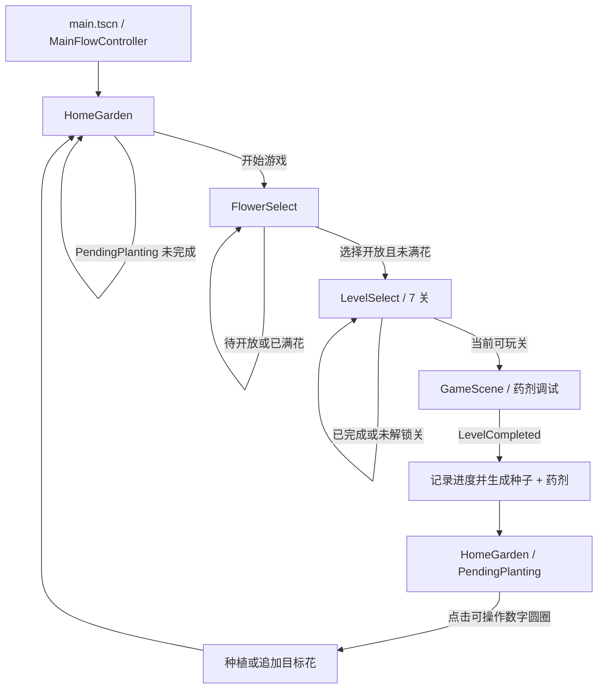
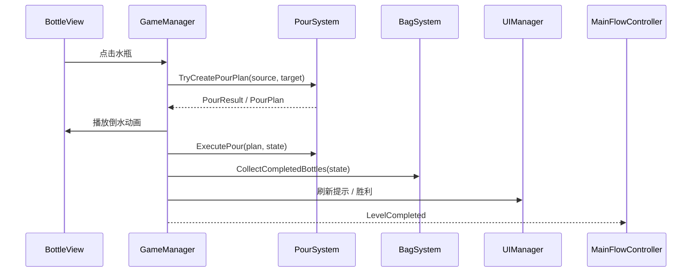

# 04 架构文档

本文件是本项目第四份权威文档，负责架构层面的权威记录。

## 架构版本信息

| 项目 | 内容 |
| --- | --- |
| 当前主入口 | `main.tscn` |
| 当前正式流程 | `HomeGarden -> 开始游戏 -> FlowerSelect -> LevelSelect -> GameScene -> 通关生成所选花种子和药剂 -> HomeGarden / PendingPlanting -> 点击可操作数字圆圈种植或追加` |
| 当前状态归属 | 外层运行状态归 `RunSessionState`；倒水关卡内部状态归 `GameState`；视图层只显示和上报输入 |
| 当前架构债务 | `Bag*` 历史命名、`RewardFlower*` 旧四选一流程遗留、简单随机关卡不保证有解、真实窗口验收未完成 |

## 状态归属表

| 模块 / 类型 | 状态归属 | 允许职责 | 不允许职责 |
| --- | --- | --- | --- |
| `RunSessionState` | 第二阶段运行期外层状态 | 保存 `SelectedFlowerId`、`SelectedLevelNumber`、每花 7 关进度、`PendingPlantingFlowerId`、`HasSeed`、`HasPotion`、`PendingPlanting`、`slot -> flower_id 集合 / batch` | 保存节点路径、图片路径、Godot 节点引用、本地存档路径或倒水关卡内部规则 |
| `GameState` | 倒水关卡内部状态 | 保存水瓶、花盆收集区计数、通关状态和关卡内数据 | 保存主页种植、目标花选择、外层奖励 |
| `HomeGardenView` | 主页显示和点击输入 | 根据 `RunSessionState` 显示花位组合；只上报数字圆圈按钮点击 | 保存唯一真实状态、绕过 `RunSessionState` 直接决定奖励 |
| `MainFlowController` | 外层流程切换 | 切换 `HomeGarden`、`LevelSelect`、`FlowerSelect`、`GameScene`；通关后生成待种植奖励 | 判断倒水合法性、保存瓶内水层数据 |
| `GameManager` | 倒水关卡内部流程 | 处理水瓶点击、调用 `PourSystem`、触发收集和 `LevelCompleted` | 选择目标花、写主页花位、处理外层种植 |
| `BottleView` | 水瓶表现层 | 显示水瓶、点击输入、倒水动画和反馈 | 判断倒水规则、保存唯一真实水层状态 |
| `FlowerSelectView` | 目标花选择表现层 | 显示 6 格、灰态待开放 / 已满花并发出开放花 `flower_id` 选择信号 | 直接进入 `GameScene` 或写入主页花位 |
| `LevelSelectView` | 关卡选择表现层 | 显示所选花的 7 个外层关卡和可玩状态 | 生成倒水关卡数据或绕过 `RunSessionState` 修改进度 |

## 信号 / 流程契约

1. `HomeGarden` 点击“开始游戏”后，由 `HomeGardenView` 发出开始意图；如果 `RunSessionState.PendingPlanting` 未完成，`MainFlowController` 停留主页并提示。
2. 无待种植奖励时，`MainFlowController` 切换到 `FlowerSelect`。
3. `FlowerSelect` 只对开放且未满花发出 `flower_id` 选择信号；待开放花和已满花只显示提示。
4. `MainFlowController` 将开放花写入 `RunSessionState.SelectedFlowerId`，然后切换到 `LevelSelect`。
5. `LevelSelect` 根据 `RunSessionState` 显示所选花的 7 个关卡，只有当前可玩关会发出关卡选择信号。
6. `MainFlowController` 将当前可玩关写入 `RunSessionState.SelectedLevelNumber` 后加载 `GameScene`。
7. `GameScene` 通关后由 `GameManager.LevelCompleted` 通知外层，不直接处理主页花园状态。
8. `MainFlowController` 接到通关信号后，记录所选花当前关完成、解锁下一关，并生成 `PendingPlantingFlowerId`、`HasSeed` 和 `HasPotion`。
9. `MainFlowController` 回到 `HomeGarden`，`HomeGardenView` 根据本次奖励花只在空位和可追加位置显示数字圆圈按钮。
10. `HomeGardenView` 只在点击数字圆圈按钮圆形区域时触发种植 / 追加意图。
11. 种植 / 追加完成后写入 `RunSessionState` 的 slot batch，并清除 `PendingPlanting`、`PendingPlantingFlowerId`、`HasSeed`、`HasPotion`。

## 禁止越界职责

- `GameScene` 不负责主页花园状态。
- `GameManager` 不负责目标花选择。
- `BottleView` 不判断倒水规则。
- `HomeGardenView` 不保存唯一真实状态。
- `RunSessionState` 不保存节点路径或图片路径。
- `PourSystem` 不处理选花、奖励、种植或主页流程。
- `FlowerSelectView` 不直接写入 `RunSessionState` 的主页花位 batch。
- `RewardFlower*` 不作为当前正式流程入口；如继续存在，仅视为历史遗留或待后续重构对象。

## 1. 文档定位

本文档记录当前 Godot 项目的整体架构、目录职责、场景关系、模块边界、数据流、状态管理、资源组织和后续扩展方向。

当前权威文档体系为：

- `docs/01_需求文档.md`：需求权威文档，负责记录产品需求、玩法目标、阶段目标和正式需求变更。
- `docs/02_执行文档.md`：执行权威文档，负责记录工程规则、执行边界、开发约束和验收方式。
- `docs/03_实现文档.md`：实现权威文档，负责记录当前实现状态、执行记录、已知问题、未确认事项和阶段验收结果。
- `docs/04_架构文档.md`：架构权威文档，负责记录整体架构、目录结构、模块职责、场景关系、数据流、状态管理、资源加载方式和扩展点。

本文档不替代需求、执行规则或实现记录。需求变化仍先更新 `01_需求文档.md`；工程规则和验收边界仍先更新 `02_执行文档.md`；实现结果和执行记录仍更新 `03_实现文档.md`。架构边界、场景关系或状态归属发生变化时，必须同步更新本文档。

不确定内容必须使用 `TODO`、`待确认` 或 `当前未确认` 标注，不应补写未经代码、场景或文档确认的结论。

## 2. 项目总览

当前项目是 Godot 4.6.2 Mono + C# 的 2D 竖屏休闲益智倒水小游戏 Demo，推荐设计分辨率为 720 x 1280，视觉方向为“魔法园丁”。

第一阶段核心玩法是倒水关卡：

- 点击源水瓶和目标水瓶。
- 按倒水规则判断能否倒水。
- 问号层按规则揭示。
- 满瓶同色后自动进入顶部花盆收集区。
- 收集完成后触发通关。

第二阶段当前正式外层循环是：

`HomeGarden -> 开始游戏 -> FlowerSelect -> LevelSelect -> GameScene -> 通关生成所选花种子和药剂 -> HomeGarden / PendingPlanting -> 点击可操作数字圆圈种植或追加`

也就是：

`花园主页 -> 选择开放目标花 -> 选择该花当前可玩关 -> 药剂调试关卡 -> 通关获得该目标花对应种子和药剂 -> 回到主页 -> 玩家点击可操作花位数字圆圈按钮种植或追加`

当前不做正式存档、正式多关卡、图鉴、花朵升级、稀有度、广告、内购或商业化系统。花园状态只在本次运行期通过 `RunSessionState` 保留，不写本地文件。

## 3. 当前项目目录结构

根据当前仓库可确认的关键结构如下：

```text
res://
├── project.godot
├── main.tscn
├── GameScene.tscn
├── README.md
├── DEVELOPMENT_LOG.md
├── TODO.md
├── docs/
│   ├── 01_需求文档.md
│   ├── 02_执行文档.md
│   ├── 03_实现文档.md
│   ├── 04_架构文档.md
│   └── archive/
├── scenes/
│   ├── home/HomeGarden.tscn
│   ├── level_select/LevelSelect.tscn
│   ├── flower_select/FlowerSelect.tscn
│   └── reward/RewardFlower.tscn
├── scripts/
│   ├── core/
│   ├── model/
│   └── view/
├── art/
│   ├── bottles/
│   ├── pots/
│   ├── title/
│   └── ui/
├── assets/
│   ├── bottles/
│   ├── flowers/combinations/{combo_key}/home_slots/
│   ├── flowers/{flower_id}/home_slots/
│   ├── flowers/{flower_id}/select/
│   ├── flowers/pink_rose/home_slots/
│   ├── flowers/yellow_rose/home_slots/
│   ├── flowers/lavender/home_slots/
│   ├── flowers/pink_rose/slots/  # 历史残留备份，不作为运行路径
│   ├── home/backgrounds/
│   ├── reward/
│   └── ui/
├── tools/
└── 素材/
```

目录职责：

- 根目录：Godot 工程配置、主场景、倒水关卡场景、README、开发日志和待办记录。
- `docs/`：当前权威文档和历史归档。`docs/archive/` 只作为历史参考，不作为当前执行依据。
- `scenes/`：第二阶段外层页面子场景。当前包括主页、关卡选择、目标花选择和旧奖励花页面。
- `scripts/core/`：流程和系统层代码，负责调度、规则、关卡生成、收集、UI 管理和外层流程。
- `scripts/model/`：纯数据模型，保存真实状态，不直接操作 Godot 节点。
- `scripts/view/`：表现层代码，负责显示、点击输入和动画反馈。
- `art/`：第一阶段瓶子、花盆、按钮、标题等资源。
- `assets/`：第二阶段主页、奖励/花朵、UI 和新瓶子资源。
- `tools/`：当前存在流程冒烟验证相关工具。
- `素材/`：外部素材收件箱 / staging input，只允许读取和复制，不允许作为运行期资源引用。

## 4. 场景架构

### 4.1 main.tscn

`main.tscn` 是第二阶段总入口和流程容器，当前 `project.godot` 的 `run/main_scene` 指向 `res://main.tscn`。

`main.tscn` 当前结构很轻量：

- 根节点 `Main` 挂载 `MainFlowController`。
- 子节点 `SceneHost` 承载当前活动子场景。

`main.tscn` 不应直接堆叠所有页面细节。页面内容应保持在 `HomeGarden`、`LevelSelect`、`FlowerSelect`、`GameScene` 等独立场景中，由 `MainFlowController` 负责加载和切换。

### 4.2 HomeGarden.tscn

`scenes/home/HomeGarden.tscn` 是花园主页。

当前职责：

- 显示主页背景。
- 提供“开始游戏”入口；“选择关卡”按钮本次隐藏且禁用，但节点保留。
- 提供 `PinkRoseSlot_01` 到 `PinkRoseSlot_07` 共 7 个固定主页花位。该命名是历史节点名，当前语义不再限定为粉玫瑰。
- 每个主页花位由 slot 锚点、花种可视化贴图节点和待种植数字圆圈按钮组成；slot 父节点不再作为种植点击入口。
- 根据 `RunSessionState.FlowerSlotBatches` 中的 `slot -> flower_id 集合 / batch` 刷新已种植组合，优先显示单花节点或组合素材，隐藏同一 slot 下其他花种节点。
- 待种植状态下，只在空花位和不包含本次奖励花的已有花位显示 `PlantMarkerButton/NumberLabel` 数字圆圈按钮；只有点击数字圆圈按钮的圆形区域才完成种植或追加。点击 slot 父节点、花图、背景或圆圈矩形外角不触发种植，也不清除 `PendingPlanting`。
- `HomeGardenView` 单花显示应以 `HomeGarden.tscn` 中的可视化花种节点作为入口；多花组合优先读取组合素材目录，缺失时显示占位并输出 warning。
- `pink_rose` 当前已完成迁移，运行引用应使用 `res://assets/flowers/pink_rose/home_slots/`。
- `yellow_rose` 当前已确认正式接入，运行引用应使用 `res://assets/flowers/yellow_rose/home_slots/`，并优先显示同 slot 下的 `YellowRoseTexture` 节点；仅当节点缺失时，才允许 fallback 到 `home_slots` 路径并输出 warning。
- `lavender` 当前已确认正式接入，运行引用应使用 `res://assets/flowers/lavender/home_slots/`，并优先显示同 slot 下的 `LavenderTexture` 节点。

主页花位状态来自 `RunSessionState`。`HomeGardenView` 负责显示和点击输入，不应成为唯一真实状态存储。

推荐节点结构：

```text
HomeGarden
└── PinkRoseSlot_01  # 历史节点名，当前代表固定主页 slot 01
    ├── FlowerTexture : TextureRect
    ├── YellowRoseTexture : TextureRect
    ├── LavenderTexture : TextureRect
    └── PlantMarkerButton : Button
        └── NumberLabel : Label
```

`PinkRoseSlot_02` 到 `PinkRoseSlot_07` 沿用同样结构。不同花种 `TextureRect` 可以拥有不同 anchors、offset、scale、`z_index`，用于适配透视、遮挡和构图差异。未确认真实花名的 `flower_04` 到 `flower_06` 不需要提前创建完整可视化节点；只有正式确认并接入素材的 `flower_id` 才需要补齐 7 个可调贴图节点。

### 4.3 FlowerSelect.tscn

`scenes/flower_select/FlowerSelect.tscn` 是当前正式流程中的目标花选择页。

当前职责：

- 展示 6 种基础花选项。
- 玩家选择后触发 `TargetFlowerSelected(flower_id)`。
- `MainFlowController.OnTargetFlowerSelected()` 将选择写入 `RunSessionState.SelectedFlowerId`。
- 选择完成后进入 `GameScene.tscn` 药剂调试关卡。
- `FlowerSelectView` 应读取 `res://assets/flowers/{flower_id}/select/` 下的选择页展示资源。
- 选择页展示资源不应与 `HomeGarden` 主页花位资源混用。
- 当前 `FlowerSelectView` 已按 `res://assets/flowers/{flower_id}/select/{flower_id}_select.png` 通用路径读取选择页展示资源；资源缺失时显示安全占位并输出 warning，按钮和花名仍保留。

目标花选择是进入 `LevelSelect` 和药剂调试关卡前的必要步骤。待开放花和已满花不得进入 `LevelSelect`。

### 4.4 LevelSelect.tscn

`scenes/level_select/LevelSelect.tscn` 是第二阶段临时外层关卡选择页。

当前职责：

- 根据当前 `SelectedFlowerId` 显示该花 7 个关卡。
- 显示已完成、当前可玩、未解锁三种状态。
- 只对当前可玩关发出关卡选择信号。
- 提供返回上一层入口。
- 不生成真实 21 套倒水数据；当前所有可玩关仍复用现有 `GameScene` 固定关卡内容。

后续正式多关卡系统应扩展 `LevelSelect` 和关卡配置/生成系统，而不应把多关卡选择逻辑塞入 `GameManager`。

### 4.5 GameScene.tscn

`GameScene.tscn` 是第 1 关倒水 / 药剂调试关卡，不再是整个项目的唯一入口。

当前职责：

- 承载第一阶段倒水玩法。
- 包含 `Managers`、`WorldRoot`、`BagRoot`、`BottleRoot`、`CanvasLayer` 等关卡内部结构。
- 通过 `GameManager`、`PourSystem`、`BagSystem`、`LevelGenerator`、`UIManager` 管理关卡内部流程。
- 被 `main.tscn` 管理时，通关后由 `GameManager.LevelCompleted` 通知 `MainFlowController`。
- 单独运行或未被主流程管理时，可保留旧胜利弹窗，便于调试关卡。

`GameScene.tscn` 不负责主页花园状态、目标花选择、种子/药剂奖励或主页花位种植。

### 4.6 RewardFlower.tscn

`scenes/reward/RewardFlower.tscn` 当前仍存在，但属于旧“四选一奖励花”流程遗留文件。

当前正式流程不再依赖 `RewardFlower.tscn`、`RewardFlowerView` 或 `RewardFlowerSystem`。通关后不再进入 `RewardFlower`，而是由 `MainFlowController` 根据 `RunSessionState.SelectedFlowerId` 创建待种植奖励并回到 `HomeGarden`。

后续可删除、归档或重构这些旧文件，但本次文档任务不执行删除和重命名。

## 5. 代码分层架构

### 5.1 数据层 Model

数据层保存真实状态，不直接操作 Godot 节点。

当前模型包括：

- `WaterColor`：倒水关卡颜色枚举。
- `WaterLayer`：单层水，保存真实颜色和 `IsRevealed`。
- `BottleData`：水瓶真实数据，保存 `Id`、`Capacity`、`Layers`、`IsCollected`。
- `BagData`：花盆收集区计数数据，当前仍使用历史命名。
- `GameState`：倒水关卡内部状态，保存水瓶、花盆收集区、选中瓶和通关状态。
- `PourPlan`：一次合法倒水计划。
- `PourResult`：倒水判断结果和失败原因。
- `RunSessionState`：第二阶段运行期外层状态。

关键约定：

- `BottleData.Layers[0]` 是底层。
- `BottleData.Layers[^1]` 是当前顶层。
- `WaterLayer.Color` 保存真实颜色。
- `WaterLayer.IsRevealed` 保存该层是否已显示。
- `RunSessionState` 保存 `SelectedFlowerId`、`HasSeed`、`HasPotion`、`PendingPlanting` 和当前 7 个主页固定花位。
- `RunSessionState.SelectedFlowerId`、`PendingPlantingFlowerId` 和 slot batch 内的元素均保存字符串 `flower_id`。当前可进入关卡的开放花仅为 `pink_rose`、`yellow_rose`、`lavender`；`flower_04` 到 `flower_06` 只作为待开放占位显示，不进入关卡或主页种植。
- 当前 `RunSessionState` 只保存在运行期，不写本地文件。

### 5.2 系统层 Core / System

系统层负责规则、流程调度和状态变更边界。

- `MainFlowController`：第二阶段外层流程控制器。负责切换 `HomeGarden`、`FlowerSelect`、`LevelSelect`、`GameScene`，持有本轮 `RunSessionState`，接收 `GameManager.LevelCompleted` 后记录关卡进度、生成待种植奖励并回主页。
- `GameManager`：倒水关卡内部流程调度。负责瓶子点击选择、调用倒水规则、播放倒水动画、执行倒水、刷新视图、触发收集和通关信号。
- `PourSystem`：倒水规则核心入口。`TryCreatePourPlan()` 判断是否可倒，`ExecutePour()` 修改 `GameState` 中的瓶内真实数据并揭示源瓶新顶层。
- `BagSystem`：历史命名，语义上对应花盆收集区。负责判断满瓶同色并更新 `BagData.CollectedCount`，同时标记水瓶已收集。
- `LevelGenerator`：关卡初始化。当前默认固定测试关卡；可选简单随机关卡入口存在，但不保证有解。
- `UIManager`：`GameScene` 内部 UI 管理，负责重开、提示、胜利弹窗。
- `FlowerSelectSystem`：提供 6 种基础目标花选项，每个选项包含正式 `flower_id` 和显示名。若 UI 内部使用 `Index` 排列或定位按钮，该 index 只是临时 UI 索引，不属于运行期状态。
- `RewardFlowerSystem`：旧四选一奖励花系统遗留，不是当前正式主流程核心。

边界要求：

- `PourSystem` 不处理选花、种植、奖励或主页花园状态。
- `GameManager` 不直接写主页花位，只通过 `LevelCompleted` 通知外层流程。
- `MainFlowController` 不应承载倒水规则细节。
- `BagSystem` / `BagData` / `BagSlotView` 是历史命名，除非有单独迁移任务，不在普通文档或小改动任务中随意重命名。

### 5.3 表现层 View

表现层负责显示、点击输入和动画反馈，不应保存唯一真实状态。

- `BottleView`：水瓶显示、点击、选中上移、无效摇晃、倒水动画、瓶内水层显示。倒水规则由 `PourSystem` 判断，`BottleView` 不判断倒水合法性。
- `BagSlotView`：花盆收集区显示，刷新收集数量并加载对应颜色花盆图。
- `PourFxView`：监听 `GameManager.TransferCommitted` 和 `GameManager.PouringStateChanged` 信号显示水流效果，不修改游戏数据。
- `HomeGardenView`：主页按钮、7 个固定主页花位显示、待种植数字圆圈按钮输入、已种植组合显示和临时种植反馈。刷新时根据 slot batch 显示单花节点、组合素材或组合缺失占位；不得把多个单花素材叠加为正式组合表现。
- `LevelSelectView`：显示所选花的 7 个临时外层关卡和返回入口。
- `FlowerSelectView`：目标花选项按钮、花名和花图显示。当前只从 `res://assets/flowers/{flower_id}/select/{flower_id}_select.png` 读取选择页花图；缺图时显示安全占位，不读取主页 `home_slots` 资源作为选择图。
- `RewardFlowerView`：旧四选一奖励花页面表现，当前正式流程不再依赖。

## 6. 主流程架构

当前正式主流程如下：



说明：

- 旧 `RewardFlower` 四选一流程已被替换。
- 通关后不再进入 `RewardFlower`。
- HomeGarden 的“选择关卡”按钮本次隐藏且禁用，不作为入口。
- 主页 7 个固定花位不是 `GameScene` 内部花盆收集区；每个主页位置保存一批不同 `flower_id`。
- `GameScene` 内部的 `BagSystem` / 花盆收集区只代表药剂调试关卡完成进度，不等同于 `HomeGarden` 的主页种植花位。

## 7. 倒水关卡内部流程

当前倒水关卡内部流程如下：



实际边界：

- `BottleView` 接收点击并发出瓶 ID。
- `GameManager` 管理当前选中瓶和输入锁。
- `PourSystem.TryCreatePourPlan()` 判断能否倒水。
- `BottleView.PlayPourAnimationTo()` 播放来源瓶移动、倾斜和水位预览动画。
- `PourSystem.ExecutePour()` 修改真实瓶内数据。
- `BagSystem.CollectCompletedBottles()` 判断满瓶同色自动收集。
- `UIManager` 显示提示、隐藏或显示胜利弹窗。
- `GameManager.LevelCompleted` 是外层流程信号。

## 8. 数据流与状态管理

### 8.1 关卡内状态

关卡内状态由 `GameState` 管理：

- `Bottles`：6 个 `BottleData`。
- `BottleData.Layers`：瓶内水层，底层到顶层顺序保存。
- `WaterLayer`：真实颜色和揭示状态。
- `Bags`：4 色花盆收集区计数，当前数据类型为 `BagData`。
- `SelectedBottleId`：模型中存在，但当前 `GameManager` 同时使用私有 `_selectedBottleId` 管理点击流程。
- `IsGameOver`：关卡是否结束。

待确认：`GameState.SelectedBottleId` 当前是否仍需要保留，或应由后续重构统一到 `GameManager` 内部状态。

### 8.2 外层运行期状态

外层运行期状态由 `RunSessionState` 管理：

- `SelectedFlowerId`：玩家本轮选择的目标花。
- `SelectedLevelNumber`：本轮进入的当前可玩外层关卡编号。
- 每花已完成关卡数量：3 个开放花各自独立记录 0 到 7。
- `HasSeed`：通关后是否持有待种植种子。
- `HasPotion`：通关后是否持有待种植药剂。
- `PendingPlanting`：是否处于等待主页种植 / 追加状态。
- `PendingPlantingFlowerId`：本次必须即时使用的奖励花。
- `FlowerSlotBatches`：当前 7 个主页花位，每个位置保存一个有序 `flower_id` 集合；空集合表示空位。
- `IsGardenFull`：兼容旧语义，仅表示 7 个位置是否都有至少一朵花；不再用于判断是否能追加不同花。
- 资源路径由 View 层或花素材配置根据 `flower_id` 推导或读取，不写入 `RunSessionState`。

当前不做本地存档。关闭运行后，`RunSessionState` 不会持久保留。

### 8.3 状态边界

- 倒水玩法状态不应知道主页花园状态。
- 主页种植状态不应写入 `PourSystem`。
- `GameScene` 通关只发信号，外层奖励和种植由 `MainFlowController` / `RunSessionState` 负责。
- `HomeGardenView` 只根据 `RunSessionState` 刷新显示并上报数字圆圈按钮点击，不直接绕过状态对象写花位。
- 未来如果做存档，应从 `RunSessionState` 或独立 `SaveData` / `SaveSystem` 扩展，不应把存档逻辑塞进 `BottleView`、`PourSystem` 或 `UIManager`。

## 9. 资源加载与美术资源结构

当前可确认资源目录：

- `art/bottles/`：第一阶段瓶子相关资源，包括空瓶、完成瓶、问号瓶等。
- `art/pots/`：红、蓝、黄、绿花盆资源，当前 `BagSlotView` 会按颜色加载。
- `art/ui/`：帮助、提示、关卡、重开、设置等按钮资源。
- `art/title/`：标题资源。
- `assets/bottles/`：新瓶子素材和液体遮罩，当前 `BottleView` 使用 `res://assets/bottles/bottle_new.png` 和 `res://assets/bottles/bottle_liquid_mask.png`。
- `assets/home/backgrounds/`：主页背景，当前 `HomeGarden` 使用 `res://assets/home/backgrounds/home_garden_bg_v1.png`。
- `assets/flowers/combinations/{combo_key}/home_slots/`：长期推荐的主页组合素材目录。每个组合需要 7 张主页固定位置贴图，命名为 `{combo_key}_slot_01.png` 到 `{combo_key}_slot_07.png`。
- `assets/flowers/{flower_id}/home_slots/`：当前单花组合可继续使用的主页已种植花位资源目录。每一种开放花需要 7 张主页固定位置贴图，命名为 `{flower_id}_slot_01.png` 到 `{flower_id}_slot_07.png`。
- `assets/flowers/{flower_id}/select/`：长期推荐的目标花选择页资源目录。每一种花至少需要 1 张选择页展示图或卡片图，推荐命名为 `{flower_id}_select.png`。
- `assets/flowers/pink_rose/home_slots/`：当前 `pink_rose` 已完成迁移后的主页 7 个固定花位贴片目录，命名为 `pink_rose_slot_01.png` 到 `pink_rose_slot_07.png`。
- `assets/flowers/yellow_rose/home_slots/`：当前 `yellow_rose` / 黄玫瑰已接入的主页 7 个固定花位贴片目录，命名为 `yellow_rose_slot_01.png` 到 `yellow_rose_slot_07.png`。
- `assets/flowers/lavender/home_slots/`：当前 `lavender` / 薰衣草已接入的主页 7 个固定花位贴片目录，命名为 `lavender_slot_01.png` 到 `lavender_slot_07.png`。
- `assets/flowers/pink_rose/slots/`：历史残留备份目录，不作为运行路径；如仍存在被占用文件或旧 `.import` 文件，不应被场景、脚本或运行配置引用。
- `assets/reward/`：奖励/目标花选择背景和花组装饰。
- `assets/reward/flowers/`：旧奖励/临时目标花图片目录，当前可作为历史或临时实现事实保留；正式花选择页语义应逐步对齐到 `assets/flowers/{flower_id}/select/`。
- `assets/ui/`：提示面板、叶子装饰、重开按钮等资源。
- `素材/`：外部素材收件箱 / staging input。资源流向固定为 `external staging folder -> project assets -> scene/script res:// reference`，运行期不得直接引用该目录。

花 ID 口径：

- `pink_rose`、`yellow_rose` 和 `lavender` 是当前已确认正式 `flower_id`。
- `flower_02` 已被 `yellow_rose` 替换，不再作为当前六种基础花之一。
- `flower_03` 已被 `lavender` 替换，不再作为当前六种基础花之一。
- `flower_04`、`flower_05`、`flower_06` 是待确认占位 ID。
- 占位显示名可以暂写为“待定花 04”到“待定花 06”。
- 未确认真实名称前，不应在架构、配置或资源路径中猜测玫瑰、郁金香、百合等具体花名。
- 真实花名确认后，应单独开 `flower_id` 命名迁移任务，不在普通素材接入任务中随意改 ID。

资源读取边界：

- `HomeGardenView` 优先使用 `HomeGarden.tscn` 中已节点化的花种 `TextureRect`，用于主页已种植花显示。
- `HomeGardenView` 单花优先使用节点化花种贴图，节点缺失时读取单花 `home_slots` fallback；多花组合优先读取 `assets/flowers/combinations/{combo_key}/home_slots/`，缺失时显示占位并 warning。
- `FlowerSelectView` 读取 `select` 资源，用于目标花选择页展示；缺少正式选择图时使用安全占位并输出 warning。
- `RunSessionState` / `SelectedFlowerId` 当前保存字符串 `flower_id`，不保存整数运行 ID、具体图片路径或场景节点路径；资源路径和节点显示由 View 层或花素材配置根据 `flower_id` 推导。
- 主页花位素材和选花界面素材不能混用。

待确认：

- 后续 18 个花位扩展时，正式花素材命名与 `flower_id` 的最终映射是否需要扩展。
- `素材/` 中除本次主页面背景和粉玫瑰 7 个花位外，哪些文件已经进入正式资源目录仍需逐项确认。
- HomeGarden 7 个粉玫瑰花位的最终视觉位置、点击区域手感和种植动画是否已完成真实窗口人工验收。
- 当前花园种植反馈仍是临时药剂闪光表现，是否替换为正式动画资源待确认。

## 10. UI 系统结构

- `UIManager`：只管理 `GameScene` 内部 UI，包括重开、提示、胜利弹窗。被 `MainFlowController` 管理时，通关后隐藏胜利弹窗，由外层流程接管。
- `HomeGardenView`：管理主页按钮、状态提示、待种植数字圆圈按钮和已种植花显示。
- `LevelSelectView`：管理临时关卡选择 UI。
- `FlowerSelectView`：管理目标花选择 UI。
- `RewardFlowerView`：旧奖励花选择 UI，当前正式流程不再依赖。

UI 边界：

- UI 可以发出用户意图信号，但不应直接修改不属于自己的真实数据。
- `BottleView` 不判断倒水规则。
- `FlowerSelectView` 不直接进入 `GameScene`，只发出目标花选择信号。
- `HomeGardenView` 不直接生成奖励，只发出数字圆圈按钮对应的花位点击信号并根据状态刷新显示。

## 11. 当前已知遗留问题与架构债务

- `BagSystem` / `BagData` / `BagSlotView` 命名与“花盆收集区”语义不一致。
- `RewardFlower.tscn` / `RewardFlowerView` / `RewardFlowerSystem` 属于旧四选一奖励流程遗留。
- `LevelGenerator` 简单随机不保证有解，反向打乱可解生成尚未完成。
- 当前未做本地存档。
- 当前花素材映射、种植动画和主页花位最终视觉效果仍需以真实项目文件和人工验收为准。
- 真实窗口人工点击验收在 `03_实现文档.md` 中仍标记未完成。
- `GameState.SelectedBottleId` 与 `GameManager._selectedBottleId` 的职责可能重复，待后续确认是否整理。
- 当前部分中文字符串在代码或场景文本中显示为乱码，待确认是否为文件编码或终端显示问题；本次不修改代码和场景。

## 12. 后续扩展点

### 12.1 第三阶段可能扩展

- 本地存档：建议新增 `SaveData` / `SaveSystem`，以 `RunSessionState` 的外层状态为基础扩展，不接入 `PourSystem`。
- 正式花素材接入：建议在 `FlowerSelectSystem` 或独立花配置中维护 `FlowerId -> 名称/图片/属性` 映射，`View` 只读配置。
- 种植动画：建议放在 `HomeGardenView` 或独立主页表现组件，不写入 `GameManager`。
- 正式关卡系统：建议扩展 `LevelSelect`、关卡配置和 `LevelGenerator`，不要把多关卡数据硬编码进 `GameManager`。
- 可解关卡生成：建议在 `LevelGenerator` 内新增反向打乱或求解校验逻辑，保持 `PourSystem` 只负责单次规则判断。
- 花园容量扩展或分页：建议扩展 `RunSessionState` 的花位数据结构和 `HomeGardenView` 的布局，不影响倒水关卡内部状态。

### 12.2 更后期扩展

- 图鉴：建议新增独立图鉴状态和图鉴页面，从花配置和已种植/已解锁状态读取。
- 花朵升级：建议新增花实例数据，不要只用单个 `FlowerId` 表达所有成长状态。
- 稀有度：建议进入花配置层，不直接写在按钮或图片路径判断中。
- 任务系统：建议独立任务状态和任务系统读取游戏事件，不直接嵌入 `PourSystem`。
- 音效：建议由独立音效管理或 View 层事件触发。
- 移动端适配：建议从项目设置、根 UI 布局和安全区适配处理，不应影响规则层。
- 配置表或数据驱动关卡：建议引入关卡配置读取层，由 `LevelGenerator` 消费配置生成 `GameState`。

## 13. AI 编程助手维护注意事项

后续 Codex / AI 助手执行任务前应遵守：

- 开发前先阅读 `01_需求文档.md`、`02_执行文档.md`、`03_实现文档.md`、`04_架构文档.md`。
- 新需求先更新 `01_需求文档.md`。
- 新工程规则、执行边界、验收标准先更新 `02_执行文档.md`。
- 实现结果、当前状态、执行记录、未确认事项必须更新 `03_实现文档.md`。
- 架构变化必须更新 `04_架构文档.md`。
- 不要把 `03_实现文档.md` 的“下一步建议”自动当成当前任务。
- 不要绕过 `main.tscn` 直接把第二阶段流程写回 `GameScene`。
- 不要把种植、奖励、选花逻辑写进 `PourSystem`。
- 不要让 `BottleView` 判断倒水规则。
- 不要随意重命名 `Bag*`，除非有单独迁移任务。
- 不确定就写 `TODO` / `待确认`，不要编造。
